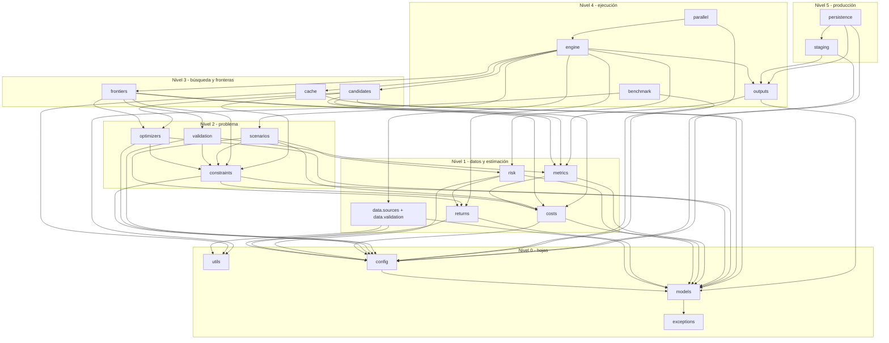

# ARCHITECTURE

# Motor profesional de optimización cuantitativa de carteras multi-escenario

> **Fase:** PROMPT 0 — Arquitectura, trazabilidad y plan de desarrollo (cerrado el 2026-09-23 con las decisiones del usuario sobre A-01 … A-37; ver §12).
> **Estado del código productivo:** Bloque 1 (Foundation) cerrado y auditado (`AUDIT_BLOCK_1.md`, `AUDIT_STATUS = PASS_WITH_CHANGES`) y **Bloque 2 (optimizador continuo y frontera eficiente) implementado el 2026-09-23**, pendiente de auditoría independiente: ver `TRACEABILITY.md` (recuento por estado) y `CHANGELOG.md`. Los requisitos de los Bloques 3–6 siguen `NOT_IMPLEMENTED`.
> **Contrato autoritativo:** `MASTER_SPEC.md`. Este documento concreta la especificación en un diseño verificable. Las ambigüedades se documentan en §12; las decisiones aprobadas que modifican el contrato se han incorporado al propio `MASTER_SPEC.md` como correcciones de formato (F-01 … F-04) y enmiendas (E-03, E-06, E-07, E-09, E-24, E-25) en su Anexo A.
>
> Las firmas y pseudocódigo de este documento son **diseño**. §3, §4.1, §9.2 y el Anexo B incorporan, para el código ya validado del Bloque 1, la implementación real cuando difiere en detalle del diseño original (desviaciones aceptadas en el cierre de auditoría del Bloque 1; ver `CHANGELOG.md`). Los bloques 2–6 siguen siendo diseño, no código.

---

## Índice

1. Contexto, alcance y entorno detectado
2. Principios arquitectónicos derivados de MASTER_SPEC
3. Estructura definitiva del repositorio
4. Grafo lógico de dependencias
5. Modelo de datos canónico y convenciones de unidades
6. Contratos de entrada
7. Contratos de salida
8. Interfaces públicas principales
9. Formulaciones matemáticas canónicas y clasificación de problemas
10. Pipelines de ejecución
11. Rendimiento, memoria, paralelismo y determinismo
12. Ambigüedades, contradicciones potenciales y decisiones propuestas
13. Evaluación de la versión anterior (`1.-Version Anterior/`)
14. Dependencias externas y solvers
Anexo B. Referencias matemáticas de la implementación del Bloque 1

---

## 1. Contexto, alcance y entorno detectado

### 1.1 Escala objetivo (MASTER_SPEC §1)

| Magnitud | Valor objetivo |
|---|---|
| Carteras | ≈ 1.200 |
| Activos por cartera | ≈ 20 |
| Universo global | ≈ 700 activos |
| Escenarios | múltiples (10 tipos, §53) |
| Composiciones candidatas por cartera | múltiples (§26) |
| Soluciones por cartera | múltiples (fronteras + estrategias nombradas) |

Orden de magnitud de memoria que condiciona el diseño: `Sigma_global` 700×700 float64 ≈ 3,9 MB. Una copia por cartera (1.200) ≈ 4,7 GB → prohibido (§59). Una submatriz 20×20 ≈ 3,2 KB.

### 1.2 Entorno detectado en la sesión de PROMPT 0 (solo inspección, sin instalar nada)

| Componente | Versión detectada | Observación |
|---|---|---|
| Sistema operativo | Windows 11 | `multiprocessing` usa **spawn** (no fork) → impacto directo en §58 (ver §11.3). |
| Python | 3.13.6 | Cumple "Python 3.11+". |
| numpy | 2.2.6 | |
| scipy | 1.16.1 | |
| pandas | 2.3.3 | |
| scikit-learn | 1.9.0 | Ledoit-Wolf / OAS disponibles; se evaluará implementación propia vs sklearn en Bloque 1. |
| osqp | 1.0.5 | API nativa v1.x (`setup/update/warm_start/solve`). |
| clarabel | 0.11.1 | Capacidades de actualización de datos a **verificar empíricamente** (§48: no asumir). |
| cvxpy | 1.7.3 | Permitido solo fuera del hot path (EXACT_MIP, validación, research). |
| pyarrow | 24.0.0 | Parquet. |
| duckdb | 1.5.5 | Staging opcional. |
| pyodbc | presente | Disponibilidad de SQL Server **no verificada**. |
| pytest | 9.0.1 | |
| threadpoolctl | 3.6.0 | §60. |
| hypothesis | **ausente** (no se instala globalmente) | Se incorpora como dependencia de desarrollo del entorno del proyecto cuando el Bloque 1 cree la gestión de dependencias (A-27). |
| Solver MIQP | **ausente** | Referencia aprobada: SCIP / PySCIPOpt, a incorporar en el Bloque 4 como dependencia opcional del grupo EXACT_MIP; Gurobi/CPLEX/MOSEK solo opcionales (A-24). |
| IPOPT (cyipopt) | **ausente** | No se incorporará mientras no exista un caso no convexo validado (A-25). |
| Git | 2.50.1; repositorio inicializado con `git init` en el cierre de PROMPT 0 (rama `master`; commit baseline `e49c70e` "Phase 0 - architecture, specification and traceability baseline"; `core.autocrlf = true`) | Permite `GitCommit` (§70) y los commits por bloque de `README_USO.md` (A-26). |

---

## 2. Principios arquitectónicos derivados de MASTER_SPEC

1. **Corrección matemática antes que velocidad** (§2). Toda optimización de rendimiento se valida contra una referencia numérica.
2. **Separación estricta de familias** (§14): `FAST_PRODUCTION`, `EXACT_MIP`, `NONCONVEX_RESEARCH` son pipelines distintos con backends distintos. El router **rechaza** (excepción) cualquier problema enviado a un backend incompatible.
3. **Dos fronteras conceptualmente distintas** (§32–33): `CONTINUOUS_FRONTIER` (composición actual fija) y `GLOBAL_CANDIDATE_FRONTIER` (múltiples composiciones + envolvente de Pareto global) son pipelines con clases distintas; nunca una se deriva de la otra por configuración.
4. **Costes dentro de la optimización** para `NET_FRONTIER` (§37–38); `POST_COST_GROSS_FRONTIER` (§39) es una evaluación ex post etiquetada de forma diferente.
5. **Validación independiente** de toda solución (§44): el estado del solver nunca basta.
6. **Índices, no copias** (§59): el universo global vive una vez; las carteras trabajan con vectores de índices y submatrices pequeñas.
7. **Configuración inmutable y única fuente de verdad** (§3–4): ningún parámetro financiero/matemático/operativo en el código de negocio.
8. **Determinismo** (§61): resultados idénticos con independencia del orden de finalización de workers, del número de workers y del tamaño de batch.
9. **Auditabilidad** (§70, §77): cada resultado es trazable a `BatchRunID`, `ConfigHash`, `MuSigmaVersion`, versiones de solver y semilla.
10. **Honestidad de estado** (§78–79): la trazabilidad refleja lo que existe y está probado; lo parcial se declara `PARTIAL` / `PARTIAL_IMPLEMENTATION`.

---

## 3. Estructura definitiva del repositorio

Basada en MASTER_SPEC §81 ("estructura recomendada"), con **adiciones justificadas** (marcadas `[+]`). Ningún directorio se creará antes del bloque que lo necesita (no se crean esqueletos vacíos ni stubs).

```
<raíz>/
├── MASTER_SPEC.md                 # contrato (no se modifica)
├── IMPLEMENTATION_PROMPTS.md      # fases autorizadas (no se modifica)
├── CLAUDE.md                      # reglas de desarrollo (no se modifica)
├── README_USO.md
├── ARCHITECTURE.md                # este documento
├── TRACEABILITY.md
├── IMPLEMENTATION_PLAN.md
├── CHANGELOG.md                   # se crea en Bloque 1
├── README.md                      # se crea en Bloque 1, se completa en Bloque 6
├── pyproject.toml                 # Bloque 1 (dependencias, pytest, mypy, ruff)
├── config/                        # [+] ficheros TOML de configuración de ejemplo/por defecto (datos, no código)
│   └── default_engine.toml
├── portfolio_engine/
│   ├── __init__.py
│   ├── exceptions.py              # [+] jerarquía de excepciones propias (§3)
│   ├── engine.py                  # [+] orquestador de alto nivel (PortfolioEngine) — Bloque 3+ (integración)
│   ├── config/                    # §4: dataclasses inmutables + carga + hash canónico
│   │   ├── engine_config.py       # EngineConfig (raíz)
│   │   ├── data_config.py
│   │   ├── return_config.py
│   │   ├── risk_config.py
│   │   ├── constraint_config.py
│   │   ├── transaction_cost_config.py
│   │   ├── frontier_config.py     # Bloque 2
│   │   ├── solver_config.py       # Bloque 2
│   │   ├── candidate_config.py    # Bloque 3
│   │   ├── scenario_config.py     # Bloque 4
│   │   ├── parallel_config.py     # Bloque 5
│   │   ├── benchmark_config.py    # Bloque 2 (micro) / Bloque 5 (completo)
│   │   ├── persistence_config.py  # Bloque 6
│   │   ├── loader.py              # TOML/dict → EngineConfig, validación de coherencia
│   │   └── hashing.py             # serialización canónica, ConfigHash, ConfigSnapshot
│   ├── models/                    # §5–7: estructuras de datos del dominio (sin lógica de negocio pesada)
│   │   ├── enums.py               # SolverStatus, ProblemClass, OptimizationFamily, FrontierScope, CostTreatment, StrategyID, ScenarioType, ...
│   │   ├── asset.py               # AssetMetadata, Universe
│   │   ├── universe_index.py      # AssetIndex: global ↔ eligible ↔ candidate-local
│   │   ├── market_data.py         # PriceHistory, ReturnsMatrix
│   │   ├── portfolio.py           # PortfolioSpec, CurrentPortfolioState, CurrentPortfolioComposition
│   │   ├── risk_model.py          # ExpectedReturns, CovarianceEstimate, RiskModel (MuSigmaVersion);
│   │   │                          # Bloque 1: también PSDDiagnostics, PSDRepairReport y ExternalAlpha
│   │   │                          # (ver §3.1) para que `models` no dependa de `risk`
│   │   ├── costs.py               # AssetCostVector (Buy/Sell resueltos, fuente, unidades)
│   │   ├── composition.py         # CandidateComposition, SwapMove  (Bloque 3)
│   │   ├── solution.py            # SolveResult, OptimizationResult, ValidationReport
│   │   ├── frontier.py            # FrontierPoint, CompositionFrontierResult, GlobalFrontierResult
│   │   └── run_metadata.py        # RunMetadata (§70)
│   ├── data/                      # §5, §10
│   │   ├── sources/
│   │   │   ├── base.py            # DataSource (Protocol)
│   │   │   ├── dataframe_source.py
│   │   │   ├── file_sources.py    # CSVSource y ParquetSource (Bloque 1: fusionados; ver §3.1)
│   │   │   └── sqlserver_source.py    # Bloque 6
│   │   └── validation/            # validación de DATOS (no de soluciones)
│   │       ├── market_data_validator.py
│   │       ├── universe_validator.py
│   │       ├── portfolio_validator.py
│   │       ├── transaction_cost_inputs.py  # Bloque 1: resolución/validación de costes unitarios (ver §3.1)
│   │       └── report.py          # DataQualityReport, DataIssue, CorrectionLog
│   ├── returns/                   # §8–9
│   │   ├── returns_engine.py      # aritméticos (defecto), log (solo con justificación)
│   │   ├── annualization.py
│   │   └── expected/
│   │       ├── base.py            # ExpectedReturnProvider (Protocol)
│   │       ├── external_alpha.py
│   │       └── historical_mean.py
│   ├── risk/                      # §11
│   │   ├── covariance/
│   │   │   ├── base.py            # CovarianceEstimator (Protocol)
│   │   │   ├── empirical.py
│   │   │   ├── ledoit_wolf.py
│   │   │   ├── oas.py             # Bloque 4 (diferido, A-07/E-07)
│   │   │   └── ewma.py            # Bloque 4 (diferido, A-07/E-07)
│   │   ├── psd_diagnostics.py
│   │   ├── psd_repair.py          # eigenvalue floor, nearest PSD (Higham)
│   │   └── risk_model_builder.py
│   ├── costs/                     # [+] §23–25 (el spec no asigna directorio; se separa por cohesión)
│   │   ├── transaction_cost_model.py  # TransactionCost(w), turnover (Bloque 2)
│   │   └── turnover.py
│   │   # Bloque 1: la resolución/validación de costes unitarios (AssetCostVector, fuentes,
│   │   # unidades) vive en data/validation/transaction_cost_inputs.py, no aquí — ver §3.1,
│   │   # desviación aceptada en el cierre de auditoría del Bloque 1.
│   ├── constraints/               # §12–13
│   │   ├── constraint_set.py      # representación declarativa + ConstraintHash
│   │   ├── linear.py              # budget, bounds, grupos, turnover, beta, factores
│   │   ├── conic.py               # volatilidad, tracking error (Bloque 4)
│   │   ├── integer.py             # cardinalidad, nuevos activos, swaps (Bloque 3/4)
│   │   ├── compiler.py            # ConstraintSet + composición → bloques matriciales
│   │   └── feasibility.py         # PreFeasibilityChecker (§13)
│   ├── scenarios/                 # §53–54 (Bloque 4)
│   │   ├── definitions.py
│   │   ├── scenario_engine.py
│   │   └── multi_scenario.py
│   ├── candidates/                # §26–31 (Bloque 3)
│   │   ├── eligibility.py
│   │   ├── screening.py
│   │   ├── exploration.py
│   │   ├── swap_generator.py
│   │   ├── local_search.py
│   │   ├── beam_search.py
│   │   ├── tabu.py
│   │   ├── composition_hash.py
│   │   ├── candidate_engine.py
│   │   └── diagnostics.py
│   ├── frontiers/                 # §32–43
│   │   ├── explicit_portfolios.py # MinVariance, MaxReturn, (MaxSharpe, VolTarget, Robust en B4)
│   │   ├── theta_calibration.py
│   │   ├── risk_aversion_grid.py
│   │   ├── target_return_grid.py
│   │   ├── adaptive.py
│   │   ├── dedup.py
│   │   ├── pareto.py
│   │   ├── continuous_frontier.py # ContinuousFrontierEngine
│   │   └── global_frontier.py     # GlobalCandidateFrontierEngine (Bloque 3)
│   ├── optimizers/                # §14–22, §45–51
│   │   ├── base.py                # OptimizationBackend (ABC), BackendCapabilities
│   │   ├── problem.py             # formas canónicas: QPForm, ConicForm, MIForm, NLPForm + ProblemClass
│   │   ├── status.py              # mapeo estados nativos → SolverStatus
│   │   ├── router.py              # SolverRouter
│   │   ├── formulations/
│   │   │   ├── qp_builder.py      # min-var, utilidad, target, net (b/s lifting)
│   │   │   ├── sharpe.py          # Bloque 4
│   │   │   ├── volatility.py      # Bloque 4
│   │   │   ├── cvar.py            # Bloque 4
│   │   │   ├── robust.py          # Bloque 4
│   │   │   ├── multi_scenario.py  # Bloque 4
│   │   │   └── miqp.py            # Bloque 4
│   │   ├── osqp_backend.py
│   │   ├── highs_backend.py       # LP (MaxReturn etapa 1) con HiGHS vía scipy.optimize.linprog (R2-01)
│   │   ├── clarabel_backend.py
│   │   ├── mixed_integer_backend.py
│   │   └── nonconvex_backend.py
│   ├── validation/                # §44: validación independiente de SOLUCIONES
│   │   ├── solution_validator.py
│   │   └── tolerances.py
│   ├── metrics/                   # [+] §55 métricas vectorizadas (el spec no asigna directorio)
│   │   ├── portfolio_metrics.py
│   │   ├── contributions.py
│   │   └── cvar_metric.py
│   ├── cache/                     # [+] §31, §62
│   │   ├── keys.py
│   │   └── result_cache.py
│   ├── outputs/                   # [+] §63–67 esquemas y builders de filas
│   │   ├── schemas.py
│   │   └── builders.py
│   ├── parallel/                  # §56–61 (Bloque 5)
│   │   ├── batching.py
│   │   ├── shared_data.py
│   │   ├── worker.py              # WorkerInitializer, WorkerContext
│   │   ├── executor.py
│   │   ├── threading_control.py
│   │   └── determinism.py         # SequenceID, derivación de semillas
│   ├── staging/                   # §68 (Bloque 6)
│   │   ├── coordinator.py
│   │   ├── parquet_staging.py
│   │   └── duckdb_staging.py
│   ├── persistence/               # §69–70 (Bloque 6)
│   │   ├── ddl/                   # *.sql (tablas §69)
│   │   ├── sqlserver_writer.py
│   │   └── run_repository.py
│   ├── benchmark/                 # §71
│   │   ├── timers.py
│   │   ├── stats.py
│   │   ├── suite.py
│   │   └── regression.py
│   └── utils/
│       ├── logging.py             # logging estructurado (JSON)
│       ├── hashing.py             # hash canónico de arrays/estructuras
│       └── numerics.py
├── tests/
│   ├── conftest.py
│   ├── fixtures/                  # generadores sintéticos deterministas (semilla explícita)
│   ├── unit/
│   ├── integration/
│   ├── property/                  # hypothesis
│   ├── numerical_regression/      # golden files versionados
│   │   └── golden/
│   ├── performance/               # regresión de rendimiento (marcador pytest dedicado)
│   └── e2e/
└── benchmarks/
    ├── scripts/
    └── results/                   # SOLO resultados de ejecuciones reales, con RunMetadata
```

**Justificación de las adiciones `[+]`:**

| Adición | Motivo |
|---|---|
| `exceptions.py` | §3 exige excepciones propias; un único módulo raíz evita dependencias circulares. |
| `engine.py` | Orquestación de alto nivel separada de los motores de cálculo (inyección de dependencias). |
| `costs/` | §23–25 es transversal (frontera, candidatos, métricas, validación); aislarlo evita duplicar la fórmula de coste. |
| `metrics/` | §55 exige un único cálculo vectorizado usado por frontera, validador y outputs. |
| `cache/` | §31/§62 definen una clave compuesta con semántica propia. |
| `outputs/` | §63–67 definen esquemas de salida independientes de la persistencia física. |
| `config/` en la raíz | Ficheros de configuración (datos) distintos del paquete `portfolio_engine/config/` (código). |
| `data/validation/` vs `validation/` | El spec usa "validación" para datos (§10) y para soluciones (§44). Se separan para no mezclar responsabilidades. |

### 3.1 Desviaciones aceptadas en el cierre de auditoría del Bloque 1

El Bloque 1 introdujo 6 diferencias puntuales respecto al diseño original de este documento,
documentadas primero en `CHANGELOG.md` (Bloque 1) y evaluadas formalmente en `AUDIT_BLOCK_1.md`
(`AUDIT_STATUS = PASS_WITH_CHANGES`). Las 6 fueron aceptadas (`ACCEPT` / `ACCEPT_WITH_CHANGES`);
ninguna sustituye Beam Search por Greedy, Global Frontier por una sola composición, Net Frontier
por Gross-menos-costes, SOCP por QP incompatible, ni MIQP por heurística. Este documento queda
actualizado para reflejarlas; el detalle de la evaluación de cada una vive en `AUDIT_BLOCK_1.md`.

| # | Diseño original (este documento) | Implementación real (Bloque 1) | Racional |
|---|---|---|---|
| 1 | Resolución de costes unitarios en `costs/` | `data/validation/transaction_cost_inputs.py` | El Bloque 1 solo valida y resuelve costes unitarios por activo (sin optimización); `costs/` queda reservado al cálculo de `TransactionCost(w)` y turnover del Bloque 2, que consumirá el `AssetCostVector` ya validado. |
| 2 | `risk` depende solo de `models`, `config` (§4.1) | `risk` también depende de `returns` (reutiliza `annualize_covariance`) | Evita duplicar la fórmula de anualización lineal (§9) dentro de `risk/`. El grafo de dependencias por capas sigue siendo acíclico (`tests/unit/test_architecture_rules.py::test_import_graph_is_acyclic`, que ya declara `risk → returns` como permitido). Ver §4.1. |
| 3 | `csv_source.py` y `parquet_source.py` como módulos separados | `data/sources/file_sources.py` (único módulo) | Ambas fuentes comparten la misma canonicalización estricta de tipos (`data/sources/base.py::canonicalize`); mantenerlas separadas duplicaría esa lógica compartida entre dos ficheros, contra GOV-009 (sin duplicación). Ambas producen tablas canónicas idénticas verificado por `tests/unit/data/test_sources.py::test_all_sources_yield_identical_canonical_tables`. |
| 4 | `NEAREST_PSD` (§9.2, P23) como proyección alterna sobre PSD ∩ diagonal unitaria (NLP Convexo, algoritmo iterativo de Higham para la matriz de *correlación* más cercana) | `NEAREST_PSD` como proyección de Frobenius en forma cerrada `Σ̂ = V·max(Λ,0)·Vᵀ` (Higham, 1988, Teorema 2.1) | La restricción de diagonal unitaria solo es necesaria para el problema de la *correlación* más cercana; para la *covarianza* más cercana (el caso de este motor) la proyección espectral cerrada es la solución exacta en norma de Frobenius, no una aproximación. No es una simplificación: es PSD, idempotente, y no hay ninguna matriz PSD más cercana en Frobenius (`tests/unit/risk/test_psd_repair.py::test_nearest_psd_is_frobenius_projection`, `tests/property/test_properties.py::test_nearest_psd_is_psd_idempotent_and_closest`). Reclasificación de tipo matemático: de **NLP Convexo** a **Álgebra lineal (proyección cerrada)** — ver §9.2 y Anexo B. |
| 5 | `PSDDiagnostics`, `PSDRepairReport`, `ExternalAlpha` en `risk/` | `models/risk_model.py` | Si vivieran en `risk/`, el paquete `models` (nivel 0, hoja) tendría que depender de `risk` (nivel 1) para tipar sus propios contratos de datos, invirtiendo la jerarquía de capas de §4.1. Reubicarlas en `models` preserva `models` como hoja sin dependencias hacia arriba. |
| 6 | — | `EngineConfig` (Bloque 1) no incluye campos para `FrontierConfig`, `CandidateConfig`, `ScenarioConfig`, `SolverConfig`, `ParallelConfig`, `PersistenceConfig`, `BenchmarkConfig` completo | Añadir esos campos como `X | None = None` antes de que sus bloques existan crearía placeholders sin funcionalidad real, prohibido por GOV-010 y por `CLAUDE.md` ("nunca declarar IMPLEMENTED... solo porque exista un placeholder o stub"). Se añaden en el bloque que los usa. |

### 3.2 Desviaciones del Bloque 2 respecto al diseño original

Registradas al implementar el Bloque 2 (ninguna sustituye Beam por Greedy, Global Frontier por una
sola composición, Net por Gross−costes, SOCP por un QP incompatible ni MIQP por heurística):

| # | Diseño original | Implementación real (Bloque 2) | Racional |
|---|---|---|---|
| 1 | Un workspace por (composición, escenario, tratamiento, **método**) (§9.4) | Un workspace QP por (composición, tratamiento) **compartido** por la malla de theta y la de retorno objetivo (`frontiers/session.py::FrontierSession`); `A` incluye siempre la fila de retorno, libre (`-inf`) en la malla de theta y fijada en la de retorno objetivo | Reutiliza la factorización también para MinVariance y la 2.ª etapa de MaxReturn; `P` y `A` siguen constantes y solo cambian `q` o `lower` (tests `test_risk_aversion_grid.py`, `test_target_return_grid.py`) |
| 2 | MaxReturn como un único problema | Etapa 1 LP (`P = 0`) y etapa 2 QP de mínima varianza (A-14). **Corregido en la remediación (§3.3, R2-01/R2-02):** el LP se resuelve con HiGHS (SciPy) y la etapa 2 se resuelve en un workspace OSQP propio sobre la cara óptima del LP, no sobre una franja `R* − ε` en el workspace compartido | Es la formulación lexicográfica aceptada; el LP no puede compartir `P` con el QP. La versión original (LP en OSQP + franja `1e-9`) falló en el 25 % de las fronteras sintéticas de la auditoría (H-1) |
| 3 | `optimizers/base.py` con `update(*, q, l, u, b)` | `update(*, q, lower, upper)`; sin `b` (no hay problemas con `b` separado) | `l`/`u` renombrados a `lower`/`upper` (ruff E741); la forma canónica no usa `b` |
| 4 | `SolveResult` y `ValidationReport` en `models/solution.py`; `FrontierPoint` en `models/frontier.py` | Igual, más `PointMetrics` y `FrontierDiagnostics` en `models/frontier.py` | Las métricas no disponibles son `None` con `unavailable_reason` (§24) |
| 5 | `metrics` depende de `costs` y `models` | Además de `config` (`MetricsTolerances.from_config`); `outputs` depende también de `costs`; `benchmark` depende de `frontiers` y `optimizers` (`solver_reuse_benchmark`) | Las tolerancias proceden de `FrontierConfig`/`SolverConfig`; el benchmark ejecuta el motor real. El grafo sigue acíclico (`test_import_graph_is_acyclic`) |
| 6 | `ClarabelBackend` "si es requerido" (A-32) | **No adoptado**: `SOL-005` sigue `NOT_IMPLEMENTED`; el router rechaza SOCP/SDP con `RoutingError` | Ningún problema del B2 lo requiere y A-32 prohíbe un backend sin uso real; el reintento ante estados ambiguos es `COLD_RETRY` con el mismo solver (`SOL-014` `PARTIAL`) |
| 7 | `EngineConfig` sin secciones de bloques posteriores (§3.1 #6) | `EngineConfig` añade `frontier`, `solver` y `benchmark` (obligatorias, sin defaults en código) | Cada sección es usada por código real del B2 (test de "sin parámetros ignorados" en `FrontierConfig`) |
| 8 | `SolverConfig` solo con parámetros del solver | Incluye las tolerancias del `SolutionValidator` (`budget/bound/constraint/variance_tolerance`) y los flags `workspace_reuse`/`warm_start` del benchmark | VAL-008 exige tolerancias de configuración; los flags permiten comparar cold setup / reuse / warm start con el mismo motor (BEN-003) |
| 9 | Ajuste de OSQP `polish` | OSQP ≥ 1.1 (`polishing`); la clave de configuración se mantiene como `polish` | `polish` está deprecado en OSQP 1.1; `adaptive_rho_interval` fijo garantiza resultados reproducibles bit a bit |
| 10 | `POST_COST_GROSS` como evaluación ex post | `post_cost_evaluation` re-etiqueta los puntos de la frontera `GROSS` (mismos pesos, nuevos `point_id` y flags de Pareto) y no resuelve nada | Es la definición del §39; nunca se presenta como NET |

### 3.3 Remediación del Bloque 2 tras `AUDIT_BLOCK_2.md`

Decisiones tomadas en la remediación (instruidas por el usuario tras la auditoría; no forman parte
de las ambigüedades A-01…A-37 de PROMPT 0, por eso llevan el prefijo `R2-`). Ninguna sustituye
Beam por Greedy, Global Frontier por una sola composición, Net por Gross − costes, SOCP por un QP
incompatible ni MIQP por una heurística.

| # | Hallazgo | Decisión | Racional y verificación |
|---|---|---|---|
| R2-01 | H-1 (etapa 1) | El LP de MaximumReturn (`P = 0`) se resuelve con **HiGHS** vía `scipy.optimize.linprog(method="highs")` (`optimizers/highs_backend.py`, `HiGHSLPBackend`); OSQP sigue siendo el backend de los QP. El router envía `QP → OSQP` y `LP → HiGHS`. SciPy ya es dependencia de runtime: no se añade ninguna. `scipy.optimize` queda confinado a ese módulo (`test_scipy_optimize_confined_to_the_lp_backend`). Estados de `linprog` mapeados sin colapsar (`map_highs_status`: OPTIMAL, MAX_ITERATIONS/TIME_LIMIT, INFEASIBLE, UNBOUNDED, NUMERICAL_ERROR, UNKNOWN) | OSQP (ADMM) no converge de forma fiable en LP con `P = 0` (4 de 96 fronteras sin resultado, 250 000 iteraciones). El backend no admite warm start (`linprog` no lo expone): lo declara en `BackendCapabilities` y lanza `SolverError` si se pide |
| R2-02 | H-1 (etapa 2) | La etapa 2 minimiza `wᵀΣw` sobre la **cara óptima del LP**: por complementariedad, con un dual óptimo `y` las soluciones óptimas son exactamente las factibles que dejan activas las filas con `\|y_i\| > lp_feasibility_tolerance` (se fijan como igualdades); además `retorno ≥ R* − tol`, `tol = max(max_return_tie_abs_tolerance, max_return_tie_rel_tolerance·\|R*\|)` (unidades de retorno anualizado, `SolverConfig.max_return_tie_tolerance`, única fuente; sustituye a `frontier.max_return_tie_epsilon = 1e-9`). Se resuelve en un workspace OSQP **propio**, sin contaminar el `rho` del compartido | La franja `R* − 1e-9` es un conjunto casi degenerado y OSQP declara `primal infeasible` espuriamente (su `eps_prim_inf` es 1e-4) aunque se amplíe a 1e-5; con la cara óptima fijada el QP es trivialmente factible (medido: 7 de 7 casos difíciles `OPTIMAL` en ~300 iteraciones, desviación ~1e-12 respecto al vértice del LP). La holgura `tol` es solo un margen numérico y no relaja el objetivo financiero: en la cara, el retorno vale `R*` |
| R2-03 | M-3 | **Activos actuales fuera de la composición** (`ConstraintCompiler` ya no los rechaza): se liquidan por completo. `CompiledConstraints.exited` (`ExitedPosition`: peso, restringido, política) y `exit_turnover = 0.5·Σ\|w0\|` retirados; `TransactionCostModel.exit_cost_one_off() = K_E` (`Σ_j sell_j·w0_j`); `BuiltProblem.return_offset = K_E/H` en NET (fila de retorno neta: `≥ R + K_E/H`); fila `MaxTurnover`: `½(1ᵀb + 1ᵀs) ≤ T − exit_turnover`; factibilidad previa: `REMOVED_ASSETS_TURNOVER_ABOVE_MAX` y turnover mínimo forzado `+ exit_turnover`; validador: turnover `0.5·(Σ_comp\|w−w0\| + Σ_retirados\|w0\|)`; métricas de la cartera actual evaluadas sobre la unión. Restringidos retirados: `HOLD_OR_REDUCE`/`FORCE_LIQUIDATE` compatibles; `FREEZE_WEIGHT` con peso > 0 no puede salir (`FREEZE_WEIGHT_EXITED`, rechazo previo al solver) | Puntos que `AUDIT_BLOCK_2.md` señalaba a extender antes del B3 (offset de coste en la fila de retorno y el objetivo; offset de turnover en la fila `MaxTurnover`, en el validador y en la factibilidad). `K_E` no altera el argmin de las mallas (`θ·K_E/H` aditivo) pero sí la fila de retorno neta. Sin `CandidateEngine`. `TC-011` queda `PARTIAL` (integración con la generación de composiciones y TST-014 en B3) |
| R2-04 | M-1 | La frontera adaptativa puntúa huecos y curvatura con el retorno del tratamiento: `GROSS` → bruto; `NET` → neto (`μᵀw − TC(w)`, con liquidaciones); `POST_COST_GROSS` → neto de los pesos `GROSS` (la curva publicada es (volatilidad, retorno tras costes); la resolución sigue siendo la de `GROSS`, sin resolver nada nuevo) | `frontiers/adaptive.py::scoring_return`. Test diseñado para fallar si NET vuelve a puntuar con bruto (`test_net_adaptive_frontier_is_scored_with_the_net_return`) |
| R2-05 | L-1 | La regla de precedencia de la política de restringidos (`spec → global`) vive en `models/portfolio.py::resolve_restricted_policy`; `ConstraintSet` y `data/validation/portfolio_validator.py::effective_restricted_policy` delegan en ella. El compilador y el validador **siguen siendo implementaciones independientes** de la semántica (HOLD/FREEZE/FORCE): la independencia del `SolutionValidator` (§44) prevalece sobre la deduplicación | `tests/unit/validation/test_policy_consistency.py` garantiza que ambos aceptan exactamente los mismos pesos para las tres políticas y para restringidos no mantenidos |
| R2-06 | M-2 | **Diagnósticos por fase**: `FrontierDiagnostics` incorpora `min_variance_time`, `max_return_time`, `grid_time`, `total_iterations` (incluye el LP y la etapa 2) y `endpoint_iterations`; `benchmark/suite.py` los reporta por separado para que el efecto de `workspace_reuse`/`warm_start` (solo en malla y MinVariance) no se confunda con el coste de los extremos (LP y etapa 2). Con estas dos resoluciones adicionales por frontera, `setup_count` es 3 (QP compartido + LP + etapa 2) | Decisión ya aceptada en `AUDIT_BLOCK_2_CLOSURE.md` (`ACCEPT_WITH_CHANGES`: asignarle identificador); esta entrada solo la formaliza, sin cambio de comportamiento. Verificación: `tests/unit/benchmark/test_benchmark.py` y `benchmarks/results/solver_reuse_20assets_20260923T172754Z.json` |

Los diagnósticos por fase (M-2) constan como decisión `R2-06` en la tabla anterior.
---

## 4. Grafo lógico de dependencias

### 4.1 Dependencias entre paquetes (dirección: "depende de")

Regla: el grafo es **acíclico**. `models`, `exceptions`, `utils` y `config` son hojas; ningún módulo inferior importa uno superior. Se verifica con un test de grafo de importaciones
(GOV-008, `tests/unit/test_architecture_rules.py::test_layered_dependencies` y
`::test_import_graph_is_acyclic`).

> **Bloque 1 (desviación aceptada #2, ver §3.1):** `risk` depende también de `returns`
> (reutiliza `returns.annualization.annualize_covariance` en vez de duplicar la fórmula lineal
> de anualización dentro de `risk/`). El grafo sigue siendo acíclico; la arista `RSK --> RET` del
> diagrama siguiente ya refleja la dependencia real, y `ALLOWED_DEPENDENCIES` en
> `test_architecture_rules.py` la declara explícitamente permitida.



Notas:
- `optimizers` **no** depende de `frontiers` ni de `candidates`: los backends son agnósticos del significado financiero.
- `candidates` depende de `optimizers` solo para evaluar composiciones mediante QP pequeños (opción configurable, ver §10.3).
- `validation` depende de `metrics` (reutiliza el cálculo vectorizado) pero **no** de `optimizers` (independencia del validador, §44).
- `benchmark` se inyecta como colector (sin dependencia inversa hacia el motor).

### 4.2 Dependencias lógicas entre capacidades (orden de construcción)

```mermaid
flowchart LR
    C[Config inmutable + hash] --> D[Datos + validación]
    D --> R[Retornos + anualización]
    R --> MU[Expected returns]
    R --> SG[Covarianza + PSD diag/repair]
    D --> TCm[Modelo de costes + estado actual]
    MU & SG --> RM[RiskModel global + MuSigmaVersion]
    TCm & RM --> CS[ConstraintSet + pre-factibilidad]
    CS --> BK[Backends OSQP/Clarabel + router + estados]
    BK --> SV[SolutionValidator]
    SV --> CF[Continuous Frontier: MinVar/MaxRet/θ-grid/target-grid/Net/PostCost/Adaptive/Dedup/Pareto]
    CF --> CE[CandidateEngine: screening/swaps/local/beam/tabu]
    CE --> GF[Global Candidate Frontier + Pareto global]
    GF --> SC[Escenarios + multi-escenario]
    BK --> SOCP[Max Sharpe / VolLimit / TE / CVaR / Robust]
    SC & SOCP --> ADV[Optimización avanzada por ScenarioID]
    BK --> MIP[EXACT_MIP validación]
    CE --> MIP
    ADV --> HPC[Batching + shared memory + cache + determinismo]
    HPC --> PRS[Coordinator + staging + SQL Server + auditoría]
```



---

## 5. Modelo de datos canónico y convenciones de unidades

### 5.1 Identidad de activos

- **`AssetID`** es la clave canónica interna (string). `Ticker` es un alias de presentación. Toda entrada que llegue por `Ticker` se resuelve a `AssetID` mediante el universo; tickers ambiguos o no resolubles son errores de validación (A-31).
- **`AssetIndex`** (Bloque 1, extendido en Bloque 3): mapeo determinista `AssetID → global_idx` (orden lexicográfico estable de AssetID). Tres niveles:
  - `global_idx ∈ [0, N_universe)`: posición en `mu_global`, `Sigma_global`.
  - `eligible_idx`: vector `int64` de índices globales elegibles para una cartera (no se copia `Sigma`).
  - `local_idx ∈ [0, n_composition)`: posición dentro de una composición; `composition.global_indices[local_idx] = global_idx`.

### 5.2 Convenciones de unidades (obligatorias en todo el motor)

| Magnitud | Unidad interna | Notas |
|---|---|---|
| Pesos | fracción decimal del NAV (1,0 = 100 %) | `sum(w) = 1` (§12). |
| Retornos esperados `mu` | decimal, **anualizado** | `mu_annual = TradingDays · mu_daily` (§9). |
| Covarianza `Sigma` | decimal², **anualizada** | `Sigma_annual = TradingDays · Sigma_daily`. |
| Volatilidad | decimal anualizada | `sqrt(w'Σw)`. |
| Costes unitarios `BuyCost_i`, `SellCost_i` | fracción decimal del nocional negociado | La entrada en bps se convierte vía `TransactionCostConfig.input_unit` (A-04). |
| Horizonte `H` | años | `EngineConfig.optimization_horizon_years` (`OptimizationHorizonYears`), valor por defecto 1.0 declarado solo en la configuración (A-03, enmienda E-03). |
| `TransactionCostOneOff` | fracción del NAV | Coste único del rebalanceo (modelo §23). |
| `TransactionCost` | unidades de retorno anualizado | `TransactionCostOneOff / H` (A-03, E-03). Ninguna fórmula contiene un horizonte literal. |
| Turnover | fracción `0.5·Σ abs(Δw)` ∈ [0, 1] (con presupuesto 1) | §24. |
| Tasa libre de riesgo `rf` | decimal anualizada | `ReturnConfig.risk_free_rate`. |
| Tiempos | segundos (float, `perf_counter`) | §71. |

### 5.3 Estado actual de cartera (§7, §24)

`CurrentPortfolioState` (inmutable):
- `portfolio_id`, `has_current_portfolio: bool`.
- `current_global_indices: int64[k]`, `current_weights: float64[k]` (ordenados por `global_idx`).
- `nav: float | None` (necesario solo para liquidez basada en ADV, A-11).
- Derivados: `current_composition_hash` y `current_portfolio_state_hash` = **`CurrentPortfolioStateHash`** (A-06, E-06): SHA-256 sobre la serialización canónica de los pares `(AssetID, CurrentWeight)` ordenados por `AssetID`, con pesos serializados exactamente (`float.hex`, `-0.0` normalizado a `0.0`, sin redondeo) y excluidas las filas de peso exactamente cero. Invariante al orden de filas de entrada; cambia ante cualquier cambio de peso. Se usa en las claves de caché (§11.6).

Si `has_current_portfolio = False`: `Turnover`, `TransactionCost`, `ExpectedReturnNet`, `IsNetEfficient`, `NumberNewAssets`, `NumberRemovedAssets` se marcan **no disponibles** (`NULL` + `AvailabilityReason`), nunca se inventan (§24).

### 5.4 Enumeraciones principales (`models/enums.py`)

| Enum | Valores |
|---|---|
| `SolverStatus` (§45) | `OPTIMAL`, `OPTIMAL_INACCURATE`, `INFEASIBLE`, `UNBOUNDED`, `MAX_ITERATIONS`, `TIME_LIMIT`, `NUMERICAL_ERROR`, `INSUFFICIENT_PROGRESS`, `UNKNOWN` |
| `StatusSource` [+] | `SOLVER`, `PRE_SOLVER_CHECK`, `VALIDATOR`, `CROSS_CHECK` (A-15) |
| `ProblemClass` | `QP`, `LP` (subclase de QP con P=0), `SOCP`, `SDP` (A-23), `MIQP`, `MIQCP`, `MISOCP`, `NLP_CONVEX`, `NLP_NONCONVEX`, `HEURISTIC` |
| `OptimizationFamily` (§14) | `FAST_PRODUCTION`, `EXACT_MIP`, `NONCONVEX_RESEARCH` |
| `FrontierScope` (A-05) | `CONTINUOUS_FRONTIER`, `GLOBAL_CANDIDATE_FRONTIER` |
| `CostTreatment` (A-05) | `GROSS`, `NET`, `POST_COST_GROSS` |
| `FrontierMethod` | `RISK_AVERSION_GRID`, `TARGET_RETURN_GRID`, `ADAPTIVE` |
| `StrategyID` (A-20) | `CURRENT`, `MIN_VARIANCE`, `MAX_RETURN`, `MAX_SHARPE`, `VOLATILITY_TARGET`, `QUADRATIC_UTILITY`, `MIN_CVAR`, `ROBUST`, `SCENARIO_EXPECTED_UTILITY`, `SCENARIO_WORST_CASE`, `BASE_WITH_STRESS`, `FRONTIER_POINT` |
| `ScenarioType` (§53) | `BASE`, `BULL`, `BEAR`, `STRESS`, `RATE_UP`, `RATE_DOWN`, `EQUITY_CRASH`, `CREDIT_WIDENING`, `FX_SHOCK`, `CUSTOM` |
| `MultiScenarioMode` (§54) | `SCENARIO_INDEPENDENT`, `EXPECTED_SCENARIO_UTILITY`, `WORST_CASE`, `BASE_WITH_STRESS_CONSTRAINTS` |
| `CovarianceMethod` (§11) | `EMPIRICAL`, `LEDOIT_WOLF` (Bloque 1); `OAS`, `EWMA` se añaden en el Bloque 4 junto con su implementación, para no exponer métodos seleccionables sin implementar (A-07/E-07) |
| `PSDRepairMethod` (§11) | `NONE`, `EIGENVALUE_FLOOR`, `NEAREST_PSD` |
| `ExpectedReturnMode` (§8) | `INTERNAL_ESTIMATION`, `EXTERNAL_ALPHA` |
| `RestrictedExistingPositionPolicy` (A-09, E-09) | `HOLD_OR_REDUCE`, `FREEZE_WEIGHT`, `FORCE_LIQUIDATE` |
| `CandidateType` (§66) | `HIGH_CONVICTION`, `DIVERSIFICATION`, `EXPLORATION`, `CURRENT_HOLDING` |
| `ImplementationStatus` | `NOT_IMPLEMENTED`, `PARTIAL`, `IMPLEMENTED`, `VALIDATED` |

---

## 6. Contratos de entrada

Todas las entradas llegan por un `DataSource` (§5.1) y se validan antes de uso (§10). Formato lógico: tablas largas (long format). Tipos: `str`, `date`, `float64`, `bool`, `int64`.

### 6.1 Histórico de mercado (§5.1)

| Campo | Tipo | Obligatorio | Regla de validación |
|---|---|---|---|
| `Date` | date | sí | fechas válidas, monótonas por activo, sin duplicados `(Date, Ticker)` |
| `Ticker` / `AssetID` | str | sí | resoluble en el universo |
| `AdjustedClose` | float64 | sí | finito, `> 0` |
| `Volume` | float64 | no | finito, `≥ 0` |
| `Bid`, `Ask` | float64 | no | finitos, `0 < Bid ≤ Ask` |
| `FXRate` | float64 | no | finito, `> 0` |
| `MarketCap` | float64 | no | finito, `≥ 0` |

### 6.2 Universo de inversión (§6)

`AssetID`, `Ticker`, `Sector`, `Industry`, `Country`, `Currency`, `AssetClass`, `EligibleFlag`, `LiquidityFlag`, `MinWeight`, `MaxWeight`, `EstimatedTransactionCost`, `BuyCost`, `SellCost`, `BidAskSpread`, `ADV`, `MarketCap`, `RestrictedAssetFlag`.

- Obligatorios: `AssetID`, `Ticker`, `EligibleFlag`. Obligatorios condicionales: los campos de agrupación (`Sector`, `Country`, `AssetClass`, `Currency`) si existe una restricción de grupo configurada sobre ellos; al menos una fuente de coste (A-04) si se solicita `NET_FRONTIER`.
- `MinWeight ≤ MaxWeight`, ambos en `[0, 1]` si `LongOnly`.

### 6.3 Carteras actuales (§7)

| Campo | Regla |
|---|---|
| `PortfolioID` | str |
| `AssetID` / `Ticker` | resoluble; sin duplicados por cartera |
| `CurrentWeight` | finito, `≥ 0` si LongOnly; `abs(Σw − 1) ≤ tol` (tolerancia de `DataConfig`); ver A-34 para residuos de caja |

### 6.4 Especificación por cartera (§7)

`PortfolioID`, `TargetPortfolioSize`, `VolatilityLimit`, `MaxTurnover`, `InvestmentUniverse` (lista o identificador de sub-universo), restricciones específicas (overrides de `ConstraintConfig`), `NAV` opcional (A-11), `ReferenceBenchmarkID` opcional (A-10).
Regla de precedencia (única fuente de verdad): **override por cartera > ConstraintConfig global > campo del universo por activo** para límites de peso; se registra la fuente efectiva de cada límite.

**Activos restringidos ya en cartera (A-09, E-09).** `ConstraintConfig.restricted_existing_position_policy: RestrictedExistingPositionPolicy | None` (override por cartera permitido con la misma precedencia). `PortfolioValidator` rechaza (error de configuración) cualquier cartera con un activo `RestrictedAssetFlag = True` y `CurrentWeight > 0` si la política efectiva no está definida; ningún código aplica un valor implícito. `config/default_engine.toml` (ejemplo) y los fixtures de test usan `HOLD_OR_REDUCE`. Límites efectivos que genera `ConstraintCompiler`:

| Política | Semántica | Límites efectivos del activo restringido `i` con `w_current_i > 0` |
|---|---|---|
| `HOLD_OR_REDUCE` | Puede mantener o reducir su peso, incluso hasta cero; nunca incrementarlo. | `0 <= w_i <= min(w_current_i, MaxWeight_i)` |
| `FREEZE_WEIGHT` | El peso no puede incrementarse ni reducirse durante la optimización. | `w_i = w_current_i` |
| `FORCE_LIQUIDATE` | La posición debe llevarse a cero, sujeto a factibilidad y restricciones aplicables. | `w_i = 0` (venta completa con su coste, §23) |

- `HOLD_OR_REDUCE` prevalece sobre `MinWeight` para ese activo (puede llegar a cero), y `MaxWeight` sigue aplicando como cota superior.
- `FREEZE_WEIGHT` no se ajusta silenciosamente: si `w_current_i` viola `MaxWeight`, un límite de grupo u otra restricción dura, la factibilidad previa declara `INFEASIBLE` con la causa.
- `FORCE_LIQUIDATE` implica la venta completa con coste (§23) y cuenta en `Turnover`; si supera `MaxTurnover` u otra restricción, `INFEASIBLE` en la factibilidad previa con la causa.
- En `CONTINUOUS_FRONTIER` el activo sigue siendo variable de la composición (definición de pertenencia de A-08) con los límites anteriores; en `GLOBAL_CANDIDATE_FRONTIER` el `CandidateEngine` recibe la política ya traducida por `EligibilityFilter`: `FREEZE_WEIGHT` → activo fijado en todas las composiciones; `FORCE_LIQUIDATE` → activo excluido de las composiciones (sale con `K_E`); `HOLD_OR_REDUCE` → puede mantenerse o salir, nunca añadirse si no está. Ni el `CandidateEngine` ni los backends de optimización referencian los valores del enum (test de arquitectura).

### 6.5 Entradas opcionales [+] (necesarias para restricciones del §12, ver A-10, A-22)

| Entrada | Campos | Requerida por |
|---|---|---|
| `ExternalAlpha` | `AssetID`, `ExpectedReturn`, `Horizon`/`IsAnnualized`, `AsOfDate`, `Source` | `EXTERNAL_ALPHA` (§8) |
| `ReferenceBenchmarkWeights` | `BenchmarkID`, `AssetID`, `Weight` | `TrackingError`, `BetaLimit` (si beta frente a benchmark) |
| `AssetBetas` | `AssetID`, `Beta`, `BenchmarkID` | `BetaLimit` |
| `FactorExposures` | `AssetID`, `FactorID`, `Exposure` | `FactorExposureLimits` |
| `ScenarioDefinitions` | ver §10.5 | `ScenarioEngine` (§53) |
| `SimulatedReturns` | `ScenarioID`, `SampleID`, `AssetID`, `Return` | `CVaR` (§22) si no se usan históricos |

### 6.6 Configuración (§4)

Fichero TOML (lector estándar `tomllib`, sin dependencia externa) → `EngineConfig` inmutable. `ConfigSnapshot` = serialización canónica JSON (claves ordenadas, floats en `repr`) y `ConfigHash` = SHA-256 de ese snapshot.

---

## 7. Contratos de salida

Todas las tablas incluyen `BatchRunID`. Las métricas no disponibles son `NULL` con columna/registro de motivo; nunca valores inventados (§24). Retornos, volatilidades, Sharpe y `TransactionCost` se publican en base anualizada; `OptimizationHorizonYears` se registra en `OptimizationRun` (vía `ConfigSnapshot`) para permitir la conversión a base horizonte (E-03).

### 7.1 `OptimizationRun` (§69–70)

`BatchRunID`, `InputDataTimestamp`, `ExecutionTimestamp`, `ConfigSnapshot`, `ConfigHash`, `EngineVersion`, `GitCommit`, `PythonVersion`, `NumPyVersion`, `SolverVersion` (mapa por solver), `CovarianceMethod`, `ExpectedReturnMethod`, `RandomSeed`, `RunStatus`, `PortfoliosRequested`, `PortfoliosSucceeded`, `PortfoliosFailed`.

### 7.2 `ScenarioHeader` (§63) — una fila por (`PortfolioID`, `ScenarioID`, `StrategyID`, `CompositionID`)

`BatchRunID`, `PortfolioID`, `ScenarioID`, `StrategyID`, `ExpectedReturnGross`, `ExpectedReturnNet`, `Volatility`, `SharpeRatio`, `CVaR`, `Turnover`, `TransactionCost`, `HerfindahlIndex`, `NumberAssets`, `NumberNewAssets`, `NumberRemovedAssets`, `ObjectiveValue`, `IsGrossEfficient`, `IsNetEfficient`, `IsValidSolution`, `SolverStatus`, `SolverName`, `SolverIterations`, `SolverTime`, `TotalOptimizationTime`.
Columnas adicionales [+] para trazabilidad: `CompositionID`, `FrontierScope`, `CostTreatment`, `StatusSource`, `SequenceID`, `TransactionCostOneOff` y `OptimizationHorizonYears` (E-03: `TransactionCost` = `TransactionCostOneOff / OptimizationHorizonYears`, en unidades de retorno anualizado).

### 7.3 `ScenarioWeights` / `EfficientFrontierWeights` (§64, §69 — ver A-21)

`BatchRunID`, `PortfolioID`, `ScenarioID`, `StrategyID`, `FrontierPointID`, `CompositionID`, `Ticker` (+ `AssetID`), `CurrentWeight`, `OptimizedWeight`, `WeightChange`, `IsNewAsset`, `IsRemovedAsset`, `TransactionCostAsset`, `MarginalRiskContribution`, `ExpectedReturnContribution`.
Regla: se emiten filas para la **unión** `current ∪ new` (los activos liquidados aparecen con `OptimizedWeight = 0`, `IsRemovedAsset = True` y su coste de venta, §23).

### 7.4 `EfficientFrontierPoints` (§65)

`PortfolioID`, `ScenarioID`, `FrontierType`, `FrontierPointID`, `CompositionID`, `TargetReturn`, `Theta`, `ExpectedReturnGross`, `ExpectedReturnNet`, `Volatility`, `SharpeRatio`, `Turnover`, `TransactionCost`, `IsGrossEfficient`, `IsNetEfficient`, `IsValidSolution`.
Adicionales [+]: `BatchRunID`, `TransactionCostOneOff` (E-03), `FrontierScope`, `CostTreatment`, `FrontierMethod`, `IsDuplicate`, `DuplicateOfPointID`, `IsAdaptiveInsertion`, `IsGlobalParetoEfficient`, `SequenceID`. `FrontierType` = `"{FrontierScope}:{CostTreatment}"` (A-05).

### 7.5 `CandidateDiagnostics` (§66)

`PortfolioID`, `Ticker`, `CandidateType`, `CandidateScore`, `AlphaScore`, `DiversificationScore`, `MarginalUtility`, `LiquidityScore`, `TransactionCostEstimate`, `SelectedForOptimization`, `RejectionReason`. Adicionales [+]: `BatchRunID`, `ScenarioID`, `AssetID`, señales individuales normalizadas (`MarginalRiskContribution`, `CovarianceWithPortfolio`, `RiskAdjustedReturn`, `SectorFit`, `ExpectedUtilityGain`).
Tabla complementaria [+] `CandidateCompositions`: `CompositionID`, `Assets`, `ParentComposition`, `SwapHistory`, `CandidateScore`, `EstimatedUtilityGain`, `EstimatedTurnover`, `EstimatedTransactionCost`, `CompositionHash` (contrato de Bloque 3).

### 7.6 `SolverDiagnostics` (§67)

`PortfolioID`, `ScenarioID`, `CompositionID`, `FrontierPointID`, `SolverName`, `SolverVersion`, `SolverStatus`, `Iterations`, `SetupTime`, `UpdateTime`, `SolveTime`, `ObjectiveValue`, `PrimalResidual`, `DualResidual`, `MaximumConstraintViolation`, `WarmStartUsed`. Adicionales [+]: `BatchRunID`, `StatusSource`, `NativeStatus` (texto original del solver), `ProblemClass`, `CacheHit`.

### 7.7 Dataset de visualización (§82)

Vista derivada (no tabla nueva) sobre `EfficientFrontierPoints` + `ScenarioHeader` que permite graficar: Current Portfolio, Continuous Efficient Frontier, Global Candidate Frontier, Gross Frontier, Net Frontier, Minimum Variance, Maximum Sharpe, Maximum Return, Robust Portfolio y carteras por escenario.

---

## 8. Interfaces públicas principales

Diseño (firmas orientativas en Python tipado). **No existen en el código.** Se implementarán exclusivamente en el bloque indicado.

### 8.1 Configuración (Bloque 1)

```text
@dataclass(frozen=True, slots=True)
class EngineConfig:
    data: DataConfig; returns: ReturnConfig; risk: RiskConfig
    constraints: ConstraintConfig; transaction_costs: TransactionCostConfig
    frontier: FrontierConfig | None      # Bloque 2
    solver: SolverConfig | None          # Bloque 2
    candidates: CandidateConfig | None   # Bloque 3
    scenarios: ScenarioConfig | None     # Bloque 4
    parallel: ParallelConfig | None      # Bloque 5
    benchmark: BenchmarkConfig | None    # Bloque 2/5
    persistence: PersistenceConfig | None# Bloque 6
    optimization_horizon_years: float    # OptimizationHorizonYears (A-03/E-03); > 0; defecto 1.0 solo en la config por defecto
    random_seed: int

def load_engine_config(source: Path | Mapping) -> EngineConfig          # valida coherencia
def config_snapshot(cfg: EngineConfig) -> str                          # JSON canónico
def config_hash(cfg: EngineConfig) -> str                              # SHA-256
```

Inmutabilidad profunda: colecciones internas como `tuple` / `frozenset` / `MappingProxyType`; arrays numpy nunca dentro de la config.

### 8.2 Datos (Bloque 1; SQL Server en Bloque 6)

```text
class DataSource(Protocol):
    def load_prices(self, request: PriceRequest) -> PriceHistory
    def load_universe(self) -> Universe
    def load_current_portfolios(self) -> CurrentPortfolios
    def load_portfolio_specs(self) -> Sequence[PortfolioSpec]
    def load_external_alpha(self, as_of: date) -> ExternalAlpha | None

class MarketDataValidator:  validate(prices: PriceHistory, cfg: DataConfig) -> DataQualityReport
class UniverseValidator:    validate(universe: Universe, cfg) -> DataQualityReport
class PortfolioValidator:   validate(portfolios, specs, universe, cfg) -> DataQualityReport
```

`DataQualityReport`: lista de `DataIssue(severity, code, asset_id, portfolio_id, date_range, detail)` + `CorrectionLog` (toda corrección aplicada, con política configurada que la autorizó). Política por defecto: **no corregir** (§10); errores de severidad `ERROR` detienen el pipeline de la entidad afectada.

### 8.3 Retornos y riesgo (Bloque 1; OAS/EWMA ver A-07)

```text
class ReturnsEngine:  compute(prices: PriceHistory, cfg: ReturnConfig) -> ReturnsMatrix   # aritméticos por defecto

class ExpectedReturnProvider(Protocol):
    mode: ExpectedReturnMode
    method_name: str
    def estimate(self, returns: ReturnsMatrix, index: AssetIndex, cfg: ReturnConfig) -> ExpectedReturns

class CovarianceEstimator(Protocol):
    method: CovarianceMethod
    def estimate(self, returns: ReturnsMatrix, cfg: RiskConfig) -> CovarianceEstimate

def diagnose_psd(sigma: NDArray, cfg: RiskConfig) -> PSDDiagnostics   # finitos, simetría, eigen, min eig, cond number
class PSDRepairStrategy(Protocol):
    def repair(self, sigma: NDArray, cfg: RiskConfig) -> tuple[NDArray, PSDRepairReport]

class RiskModelBuilder:  build(...) -> RiskModel   # mu_global, sigma_global (read-only), MuSigmaVersion, diagnósticos
```

### 8.4 Costes (Bloque 1 modelo de datos; Bloque 2 uso en optimización)

```text
class TransactionCostModel:
    def resolve_asset_costs(universe, cfg) -> AssetCostVector                       # precedencia A-04
    def cost(W: NDArray[K,M], w_current: NDArray[M], costs: AssetCostVector) -> NDArray[K]  # sobre la UNIÓN current∪new
def turnover(W: NDArray[K,M], w_current: NDArray[M]) -> NDArray[K]                  # 0.5·Σ|Δw|
```

### 8.5 Restricciones y factibilidad (Bloque 2; extensiones B3/B4)

```text
class ConstraintSet:        # declarativo, inmutable, hashable (ConstraintHash)
class ConstraintCompiler:
    def compile(cs: ConstraintSet, composition: CompositionView, state: CurrentPortfolioState,
                risk: RiskModelView) -> CompiledConstraints   # bloques lineales / cónicos / enteros
class PreFeasibilityChecker:
    def check(cs, composition, state) -> FeasibilityReport   # si INFEASIBLE → no se llama al solver
```

### 8.6 Optimización (Bloque 2; Clarabel/MIP/NLP en B4)

```text
class OptimizationBackend(ABC):
    name: str; version: str; capabilities: BackendCapabilities
    def supports(self, problem_class: ProblemClass) -> bool
    def setup(self, problem: CanonicalProblem) -> SetupInfo
    def update(self, *, q=None, l=None, u=None, b=None) -> UpdateInfo   # solo si capabilities lo declara
    def warm_start(self, x=None, y=None) -> None
    def solve(self) -> SolveResult      # SolverStatus normalizado + NativeStatus + diagnósticos

@dataclass(frozen=True)
class BackendCapabilities:
    supports_qp, supports_socp, supports_sdp, supports_integer, supports_nonconvex: bool
    supports_vector_update, supports_matrix_update, supports_warm_start, supports_factorization_reuse: bool

class SolverRouter:
    def route(self, problem: CanonicalProblem) -> OptimizationBackend   # por ProblemClass + OptimizationFamily
```

### 8.7 Validación de soluciones (Bloque 2)

```text
class SolutionValidator:
    def validate(self, weights_union: NDArray, compiled: CompiledConstraints, state: CurrentPortfolioState,
                 risk: RiskModelView, tol: ValidationTolerances) -> ValidationReport
    # ValidationReport: is_valid, max_violation, violations[(constraint_id, value, bound, violation)]
```

### 8.8 Fronteras (Bloque 2; global en Bloque 3)

```text
class ContinuousFrontierEngine:
    def solve(self, state: CurrentPortfolioState, scenario: ScenarioData,
              cost_treatment: CostTreatment, cfg: FrontierConfig) -> CompositionFrontierResult
    # composición = composición actual, fija

class GlobalCandidateFrontierEngine:
    def solve(self, state, scenario, candidates: Sequence[CandidateComposition],
              cost_treatment, cfg) -> GlobalFrontierResult     # frontera por composición + envolvente Pareto global
```

### 8.9 Candidatos (Bloque 3) — contrato obligatorio §26

```text
class CandidateEngine:
    def generate_candidate_compositions(self, current: CurrentPortfolioComposition,
                                        context: CandidateContext) -> list[CandidateComposition]

@dataclass(frozen=True)
class CandidateComposition:
    composition_id: str; composition_hash: str; global_indices: NDArray[int64]  # ordenados
    asset_ids: tuple[str, ...]; parent_composition_id: str | None
    swap_history: tuple[SwapMove, ...]; candidate_score: float
    estimated_utility_gain: float; estimated_turnover: float | None; estimated_transaction_cost: float | None
    candidate_type: CandidateType
```

### 8.10 Escenarios (Bloque 4)

```text
class ScenarioEngine:
    def build(self, base: RiskModel, defs: Sequence[ScenarioDefinition]) -> list[ScenarioData]
    # ScenarioData: scenario_id, type, mu_s, sigma_s (validada PSD), cost_s, constraints_s, probability
class MultiScenarioOptimizer:  solve(mode: MultiScenarioMode, ...) -> OptimizationResult
```

### 8.11 Métricas, caché, paralelo, persistencia, benchmark

```text
def compute_metrics(W: NDArray[K,M], ctx: MetricsContext) -> MetricsTable    # vectorizado (§55)
class ResultCache:  get(key: CacheKey) -> CompositionFrontierResult | None ; put(key, result)
class BatchExecutor: run(batches: Sequence[PortfolioBatch]) -> Iterator[ResultBatch]   # Bloque 5
class Coordinator:  consume(batch: ResultBatch) -> None ; finalize(run: RunMetadata)  # Bloque 6
class PersistenceWriter(Protocol): write(table: str, rows: ArrowTable, run_id: str) -> WriteReport
class BenchmarkRecorder: stage(name) -> ContextManager ; report() -> BenchmarkReport
```

---

## 9. Formulaciones matemáticas canónicas y clasificación de problemas

Notación: composición `C` con `n = |C|` activos (variables), `w ∈ R^n`, `w0` pesos actuales de la cartera **restringidos a `C`**, `E = current \ C` activos que salen (liquidados), `c_b, c_s ≥ 0` costes unitarios, `Σ_C` submatriz `n×n`, `μ_C` subvector. Forma canónica OSQP: `min ½xᵀPx + qᵀx  s.a.  l ≤ Ax ≤ u`.

> Las fórmulas del MASTER_SPEC en §14, §16, §23, §25, §35, §37 y §38 estaban corruptas por conversión Markdown y **se han corregido en el propio MASTER_SPEC** (Anexo A, F-01 … F-03) sin cambiar su significado. El Bloque 2 de `IMPLEMENTATION_PROMPTS.md` tenía la misma corrupción y se ha corregido (F-04): `min wᵀΣw − θμᵀw + θ·TC(w)`. En caso de discrepancia prevalece `MASTER_SPEC.md`.
>
> Horizonte (E-03): `TC(w)` denota siempre el coste en unidades de retorno anualizado, `TC(w) = TC_one_off(w) / H` con `H = OptimizationHorizonYears`.

### 9.1 Linealización de costes (base de toda frontera neta, §23, §37)

Variables `x = [w; b; s] ∈ R^{3n}`, con

```
w − b + s = w0_C            (n igualdades)
b ≥ 0,  s ≥ 0
TC_one_off(w) = c_bᵀ b + c_sᵀ s + K_E,     K_E = Σ_{i∈E} c_s,i · w0_i     (venta completa de activos que salen, constante)
TC(w)         = TC_one_off(w) / H                                             (unidades de retorno anualizado, E-03)
Turnover(w) = ½ (Σ|w − w0_C| + Σ_{i∈E} w0_i)          (calculado ex post desde w, no desde b+s)
```

Propiedad: para `c_b,i + c_s,i > 0` el óptimo satisface `b_i·s_i = 0`; por tanto `c_bᵀb + c_sᵀs = Σ c_b max(Δ,0) + c_s max(−Δ,0)` exactamente. La restricción `½(1ᵀb + 1ᵀs + Σ_E w0) ≤ MaxTurnover` define exactamente el mismo conjunto factible en `w` (siempre existe una descomposición complementaria). Las métricas publicadas se recalculan desde `w` (independencia del validador).

### 9.2 Catálogo de problemas y clasificación (Tarea 4 del PROMPT 0)

| # | Problema | Formulación canónica | Clase | Backend (§46) | Bloque |
|---|---|---|---|---|---|
| P1 | Minimum Variance (§17) | `min wᵀΣw` s.a. `1ᵀw=1`, `l≤w≤u`, lineales | **QP** | OSQP | 2 |
| P2 | Maximum Return (§18) | `max μᵀw` (neto: `μᵀw − TC(w)`) s.a. lineales; 2ª etapa lexicográfica `min wᵀΣw` sobre la cara óptima del LP y `retorno ≥ R* − tol` (A-14, R2-02) | **LP** + QP | HiGHS (LP) + OSQP (QP) | 2 |
| P3 | Target Return (§19, §36) | `min wᵀΣw` s.a. `μᵀw ≥ R` | **QP** | OSQP | 2 |
| P4 | Quadratic Utility / Risk Aversion (§16, §35) | `min wᵀΣw − θ μᵀw` (+ `θ·TC` si neto), `θ = 1/λ`, `P = 2Σ` constante, `q(θ)` | **QP** | OSQP | 2 |
| P5 | Net Risk Aversion (§37) | `min wᵀΣw − θμᵀw + θ(c_bᵀb + c_sᵀs)/H`; `P=blkdiag(2Σ,0,0)`, `q(θ)=θ·[−μ; c_b/H; c_s/H]` | **QP** | OSQP | 2 |
| P6 | Net Target Return (§38) | `min wᵀΣw` s.a. `μᵀw − (c_bᵀb + c_sᵀs)/H ≥ R_net + K_E/H` (fila de A constante, solo cambia `l`) | **QP** | OSQP | 2 |
| P7 | Maximum Sharpe (§20) | Charnes–Cooper: `y = κw`, `min yᵀΣy` s.a. `(μ−rf)ᵀy (−costes homogeneizados) = 1`, `1ᵀy = κ`, `lκ ≤ y ≤ uκ`, `κ ≥ 0`; con VolLimit/TE añade conos | **SOCP** (QP homogeneizado si solo lineales; se enruta como cónico, A-13) | Clarabel | 4 |
| P8 | Volatility Control (§21) | `max μᵀw − TC` s.a. `‖Lᵀw‖₂ ≤ σ_max` (`Σ = LLᵀ`) | **SOCP** | Clarabel | 4 |
| P9 | Tracking Error (§12) | `‖Lᵀ(w − w_b)‖₂ ≤ TE_max` | **SOCP** | Clarabel | 4 |
| P10 | Beta / Factor exposure limits (§12) | `β_min ≤ βᵀw ≤ β_max`, `F_min ≤ Bᵀw ≤ F_max` | **QP** (lineales) | OSQP (o el del problema huésped) | 4 |
| P11 | Min CVaR / CVaR ≤ MaxCVaR (§22) | Rockafellar–Uryasev: `min α + 1/((1−β)T) Σ u_t`, `u_t ≥ −r_tᵀw − α`, `u_t ≥ 0` | **QP** (LP) | OSQP por regla §46; fallback Clarabel configurable | 4 |
| P12 | Expected Scenario Utility (§54) | `min wᵀ(Σ_s p_sΣ_s)w − θ Σ_s p_s μ_sᵀw + θTC` | **QP** | OSQP | 4 |
| P13 | Worst-Case multi-escenario (§54) | `max t` s.a. `t ≤ μ_sᵀw − λwᵀΣ_sw − TC ∀s` (QCQP convexa → conos rotados) | **SOCP** | Clarabel | 4 |
| P14 | Base with Stress Constraints (§54) | objetivo base + `wᵀΣ_stress w ≤ σ²_stress` | **SOCP** | Clarabel | 4 |
| P15 | Robust μ caja (§52) | `max μ̂ᵀw − δᵀabs(w) − λwᵀΣw` (long-only: lineal) | **QP** | OSQP | 4 |
| P16 | Robust μ elipsoidal (§52) | `max μ̂ᵀw − κ‖Ω^{½}w‖ − λwᵀΣw` | **SOCP** | Clarabel | 4 |
| P17 | Robust Σ conjunto finito (§52) | `min t` s.a. `wᵀΣ_kw ≤ t ∀k` | **SOCP** | Clarabel | 4 |
| P18 | Robust Σ incertidumbre general (§52) | worst-case sobre conjunto PSD | **SDP** (fuera de la lista del PROMPT 0, A-23) | Clarabel (cono PSD) — opcional | 4 (opcional) |
| P19 | EXACT_MIP cardinalidad (§49) | P4/P5 + `z∈{0,1}`, `l_i z_i ≤ w_i ≤ u_i z_i`, `Σz = K`, nuevos/swaps lineales en `z` | **MIQP** | MixedIntegerBackend | 4 |
| P20 | EXACT_MIP + VolLimit/TE | P19 + conos o cuadráticas | **MIQCP / MISOCP** | MixedIntegerBackend | 4 |
| P21 | Selección discreta FAST_PRODUCTION (§26–30) | swaps, local search, beam, tabu | **Heurístico** | — (usa QP P1–P6 para evaluar) | 3 |
| P22 | NONCONVEX_RESEARCH (§50–51) | sin caso de uso validado todavía; se preferirá reformulación convexa | **NLP No Convexo** | NonConvexBackend (solo arquitectura; sin algoritmo concreto ni multi-start, A-25/E-25) | 4 (arquitectura) |
| P23 | Reparación PSD `NEAREST_PSD` (§11) | **Implementado en Bloque 1** (`risk/psd_repair.py::nearest_psd_repair`): proyección de Frobenius en forma cerrada `Σ̂ = V·max(Λ,0)·Vᵀ` (Higham, 1988, Teorema 2.1) sobre el cono PSD, sin restricción de diagonal unitaria (esa restricción es propia del problema de correlación más cercana, no del de covarianza; desviación #4 aceptada en `AUDIT_BLOCK_1.md`, ver §3.1 y Anexo B) | **Álgebra lineal (proyección cerrada)** — reclasificado desde el diseño original (NLP Convexo/proyección alterna) porque el problema real tiene solución analítica exacta | algoritmo propio (no solver) | 1 |
| P23b | Reparación PSD `EIGENVALUE_FLOOR` (§11) | **Implementado en Bloque 1** (`risk/psd_repair.py::eigenvalue_floor_repair`): `λ_i ← max(λ_i, floor·λ_max)` conservando autovectores | **Álgebra lineal (cerrado)** | algoritmo propio (no solver) | 1 |
| P24 | Ledoit-Wolf (§11) — **Implementado en Bloque 1** (`risk/covariance/ledoit_wolf.py`, fórmula propia, contrastada contra `sklearn.covariance.ledoit_wolf`; ver Anexo B) / OAS (diferido, A-07) | shrinkage analítico hacia identidad escalada | cerrado (sin optimización) | — | 1 (LW) / 4 (OAS) |
| P25 | Pre-factibilidad (§13) | reglas deterministas | — | — | 2 |

Clasificación resumida: **QP**: P1–P6, P10–P12, P15; **SOCP**: P7–P9, P13, P14, P16, P17; **SDP** (extensión): P18; **MIQP**: P19; **MIQCP/MISOCP**: P20; **NLP No Convexo**: P22; **Heurístico**: P21; **Álgebra lineal (cerrado)**: P23, P23b, P24 (reclasificados en el Bloque 1; ver Anexo B para la fórmula exacta implementada de cada uno).

### 9.3 Verificación algebraica del escalado de costes (§37, §76)

Utilidad neta: `U_λ(w) = μᵀw − TC(w) − λ wᵀΣw`, con `TC(w) = TC_one_off(w)/H`. Con `θ = 1/λ > 0`:
`argmax U_λ = argmin (1/λ)(−U_λ) = argmin wᵀΣw − θμᵀw + θTC(w)`.
Por tanto `q(θ) = θ · q₁` con `q₁ = [−μ; c_b/H; c_s/H]`: **todo** `q` escala con `θ` (incluido el bloque de costes). El test de aceptación TST-013 comprueba (a) `q(θ) = θ·q(1)` exactamente, (b) que la solución del problema θ coincide con la de `max U_λ` resuelto independientemente, y (c) que una formulación incorrecta (coste sin escalar) produce soluciones distintas en un caso diseñado.

Consistencia de horizonte (TST-022): la formulación en base horizonte `min H·wᵀΣw − θ·H·μᵀw + θ·TC_one_off(w)` y la formulación anualizada `min wᵀΣw − θμᵀw + θ·TC_one_off(w)/H` producen las mismas soluciones (una es la otra multiplicada por `H > 0`); se comprueba con varios valores de `H`.

### 9.4 Reutilización del workspace (§35, §36, §47)

| Frontera | Constante | Actualizado por punto |
|---|---|---|
| Risk aversion (bruta/neta) | `P`, `A`, `l`, `u` | `q` |
| Target return (bruta/neta) | `P`, `A`, `q` | `l` (fila de retorno) |
| Adaptive | igual que la frontera base | idem |

Se inicializa un workspace por (composición, escenario, tratamiento de coste, método) y se recorren **todos** sus puntos en el mismo worker (§56). Warm start desde el punto vecino.

### 9.5 Endpoints y rangos de grid (§35–36, A-14, A-16, A-17)

- `MinVariance` y `MaxReturn` se resuelven **explícitamente** (no como `θ=0` / `θ→∞`).
- Grid de retorno objetivo: `R ∈ [μᵀw_MV, R_max]` (neto: `[R_net(w_MV_net), R_net_max]`).
- Grid θ: rango explícito desde `FrontierConfig` o modo `AUTO` calibrado a partir de los endpoints (A-16). Escala (lineal/log) configurable.

### 9.6 Adaptive Frontier (§42)

1. Resolver `InitialFrontierPoints` (< `FrontierPoints`).
2. Métrica de hueco sobre la curva (vol, ret) normalizada: distancia euclídea entre puntos consecutivos y ángulo de curvatura.
3. Insertar nuevos parámetros (θ o R) en los intervalos de mayor hueco/curvatura (bisección en el espacio del parámetro).
4. Repetir hasta `FrontierPoints` o hasta que todos los huecos < tolerancia configurada.
Test de aceptación: el conjunto final de parámetros **no** coincide con el grid uniforme completo y los puntos insertados se marcan `IsAdaptiveInsertion`.

### 9.7 Pareto (§40)

- `IsGrossEfficient`: no dominado en (`Volatility` ↓, `ExpectedReturnGross` ↑).
- `IsNetEfficient`: no dominado en (`Volatility` ↓, `ExpectedReturnNet` ↑).
- Dominancia con tolerancias configurables; puntos inválidos (`IsValidSolution = False`) excluidos del cálculo pero **almacenados**.
- Global: la envolvente se calcula sobre la unión de puntos de todas las composiciones (`IsGlobalParetoEfficient`), sin borrar dominados.

---

## 10. Pipelines de ejecución

### 10.1 Foundation (Bloque 1)

```
DataSource → validadores (DataQualityReport) → ReturnsEngine (aritméticos, TradingDays)
→ ExpectedReturnProvider (INTERNAL_ESTIMATION | EXTERNAL_ALPHA)
→ CovarianceEstimator → diagnose_psd → PSDRepairStrategy (si procede, registrado)
→ RiskModel(mu_global, Sigma_global, MuSigmaVersion, diagnósticos)
→ TransactionCostModel.resolve_asset_costs → CurrentPortfolioState por PortfolioID
```

### 10.2 CONTINUOUS_FRONTIER (Bloque 2) — responde "¿qué es alcanzable sin cambiar activos?"

```
CurrentPortfolioState → composición C = current (fija)
→ ConstraintCompiler → PreFeasibilityChecker (si inviable: registrar causa, no solver)
→ MinVariance, MaxReturn explícitos (validados)
→ grid (RISK_AVERSION | TARGET_RETURN) × {GROSS, NET}  [workspace único por grid, update q / l]
→ AdaptiveFrontier (opcional) → SolutionValidator por punto → métricas vectorizadas
→ POST_COST_GROSS (evaluación ex post de la bruta) → Dedup → Pareto (Gross/Net)
→ CompositionFrontierResult
```

Invariante: todas las soluciones contienen exactamente el conjunto de variables `C` (TST-011; A-08 sobre pesos nulos).

### 10.3 GLOBAL_CANDIDATE_FRONTIER (Bloque 3) — responde "¿qué es alcanzable permitiendo sustitución?"

```
CurrentPortfolioComposition
→ EligibilityFilter (EligibleFlag, LiquidityFlag, Restricted, InvestmentUniverse)  [índices]
→ CandidateScreening vectorizado (9 señales) sobre eligible_idx usando Σ[eligible_idx, C] (|eligible|×n)
→ reparto exploitation/diversification/exploration (config)
→ SwapGenerator (1-swap, 2-swap, 3-swap opcional, add/drop si |C| ≠ TargetPortfolioSize)
→ LocalSearch / BeamSearch(BeamWidth, CompositionHash dedup) / Tabu (opcional)
→ list[CandidateComposition] (incluye la composición actual como referencia)
→ para cada finalista: ContinuousFrontierEngine sobre Σ_C (submatriz n×n extraída en ese momento)
   con costes de liquidación K_E de los activos que salen
→ unión de puntos → Pareto global (Gross/Net) → GlobalFrontierResult (múltiples CompositionID)
```

Evaluación de composiciones durante la búsqueda: (a) aproximación analítica de utilidad (rápida), o (b) QP pequeño de utilidad por composición (exacta para la utilidad declarada). Modo configurable en `CandidateConfig`; el modo (b) usa la caché de §31.

### 10.4 Escenarios y avanzada (Bloque 4)

```
RiskModel base + ScenarioDefinitions → ScenarioEngine → {ScenarioData_s: mu_s, Sigma_s (PSD validada), cost_s, constraints_s}
→ SCENARIO_INDEPENDENT: pipelines 10.2/10.3 por ScenarioID
→ EXPECTED_SCENARIO_UTILITY / WORST_CASE / BASE_WITH_STRESS: formulaciones P12–P14
→ estrategias nombradas: MaxSharpe (P7), VolTarget (P8), MinCVaR (P11), Robust (P15–P17)
→ EXACT_MIP en modo validación (gap vs heurística)
```

### 10.5 Definición de escenarios (A-22)

`ScenarioDefinition` (configuración/datos, sin constantes en código): `scenario_id`, `type`, `probability`, transformaciones declarativas sobre el modelo base: desplazamiento/escala de `mu` por grupo (sector/país/clase/divisa/factor), escala de volatilidad por grupo, estrés de correlación (mezcla hacia matriz de correlación objetivo), multiplicador de costes, overrides de restricciones; o `CUSTOM` con `mu_s`/`Sigma_s` suministrados. Toda `Sigma_s` pasa por `diagnose_psd`/`repair`.

### 10.6 HPC y producción (Bloques 5–6)

```
Coordinator (proceso principal)
 ├─ publica mu_global, Sigma_global, returns, metadatos numéricos en SharedMemory (read-only)
 ├─ crea PortfolioBatch (tamaño fijo o AUTO) con SequenceID
 └─ ProcessPoolExecutor(initializer=WorkerInitializer)  [spawn en Windows]
      Worker: adjunta memoria compartida por nombre, fija 1 hilo BLAS (threadpoolctl),
              procesa todas las carteras del batch, todos los puntos de cada frontera,
              devuelve ResultBatch (Arrow/NumPy compacto)
 → Coordinator ordena por SequenceID → staging (Parquet shards / DuckDB, escritor único)
 → SQL Server (fast_executemany | BCP según benchmark), transaccional e idempotente por BatchRunID
```

---

## 11. Rendimiento, memoria, paralelismo y determinismo

### 11.1 Regla de submatrices (§59)

- Nunca `Sigma[np.ix_(eligible, eligible)]` por cartera.
- Screening: `Sigma_global[eligible_idx][:, C_idx]` → `|eligible|×n` (≈ 700×20 = 14.000 floats) o, mejor, `Sigma_global[:, C_idx] @ w_C` sobre la vista compartida y luego indexar.
- Optimización: `Σ_C = Sigma_global[np.ix_(C_idx, C_idx)]` (n×n) extraída solo cuando la composición está definida.
- Test (TST-015 / PAR-006): instrumentación de asignaciones (`tracemalloc`) garantiza que ningún paso por cartera asigna O(N_universe²).

### 11.2 Métricas vectorizadas (§55)

Para `W ∈ R^{K×M}` (K puntos, M = |unión current ∪ composición|): `Ret = W μ`, `Var = rowsum((W Σ) ∘ W)`, `Vol = sqrt(max(Var,0))` (con verificación de `Var ≥ −tol`), `Sharpe = (Ret − rf)/Vol` (NULL si `Vol ≤ tol`), `Δ = W − 1w0ᵀ`, `TO = ½ rowsum|Δ|`, `TC = max(Δ,0)c_b + max(−Δ,0)c_s`, `Net = Ret − TC`, `HHI = rowsum(W∘W)`. Sin bucles Python por punto.

### 11.3 Memoria compartida en Windows (§58)

En Windows no existe `fork`; cada worker arranca con `spawn` y re-importa módulos. Por tanto:
- `multiprocessing.shared_memory.SharedMemory` con nombre, creado por el coordinador; los workers lo adjuntan en `WorkerInitializer` y construyen vistas `np.ndarray` **read-only** (`flags.writeable = False`).
- Alternativa `np.memmap` sobre fichero temporal; elección final por benchmark (Bloque 5), no por suposición.
- Gestión de ciclo de vida: `unlink` garantizado por el coordinador (context manager), también ante excepciones.

### 11.4 Threads (§60)

`threadpoolctl.threadpool_limits(1)` en el initializer + variables `OMP_NUM_THREADS`, `MKL_NUM_THREADS`, `OPENBLAS_NUM_THREADS` fijadas antes del arranque de workers. Número de workers configurable; nunca `cpu_count()` implícito (Bloque 5).

### 11.5 Determinismo (§61)

- `SequenceID` = orden canónico (PortfolioID, ScenarioID, FrontierScope, CostTreatment, CompositionID, FrontierPointID).
- Semillas: `np.random.SeedSequence(RandomSeed).spawn` derivado por `hash(PortfolioID, ScenarioID)` estable (no `hash()` de Python, que está aleatorizado).
- Desempates deterministas: por score, luego `CompositionHash`, luego `AssetID`.
- Test: resultados idénticos con 1 vs N workers y distintos `PortfolioBatchSize`.

### 11.6 Caché (§31, §62)

Clave = (`CompositionHash`, `ScenarioID`, `ScenarioHash`, `ConstraintHash`, `MuSigmaVersion`, `TransactionCostHash`, `FrontierConfigHash`, `ConfigHash`, `MarketDataTimestamp`, `CurrentPortfolioStateHash`) — unión de §31 y Bloque 5 más `CurrentPortfolioStateHash` (A-06, E-06). `CurrentPortfolioStateHash` se incluye **siempre** (decisión conservadora): no se comparten resultados cacheados entre carteras con distintos pesos actuales y cualquier cambio de pesos actuales invalida la caché de esa cartera. `ConfigHash` incluye `OptimizationHorizonYears`. Valor = `CompositionFrontierResult` completo. Test: un hit elimina llamadas reales al solver (contador de `solve()` = 0).

---

## 12. Ambigüedades, contradicciones potenciales y decisiones propuestas

Severidad: **CRÍTICA** (impide diseñar/implementar correctamente), **ALTA** (cambia resultados numéricos o contratos), **MEDIA**, **BAJA**.

**Estado (cierre de PROMPT 0, 2026-09-23):** el usuario ha **aceptado todas las decisiones propuestas**, con precisiones sobre A-01, A-02, A-03, A-06, A-07, A-09, A-24, A-25, A-26 y A-27 ya incorporadas en la columna *Decisión* (estado **ACEPTADA + PRECISIÓN**). Estas decisiones siguen visibles aquí y en `TRACEABILITY.md`.

| ID | Origen | Descripción | Severidad | Decisión | Bloque que la necesita | Estado |
|---|---|---|---|---|---|---|
| A-01 | §23 | La fórmula de coste une los términos compra/venta con `*` en lugar de `+`. El producto sería siempre 0 (términos mutuamente excluyentes) → lectura literal absurda. | ALTA (resuelta por interpretación inequívoca) | **Corregido en MASTER_SPEC §23 (F-01):** `TC = Σ_i [BuyCost_i·max(Δ_i,0) + SellCost_i·max(−Δ_i,0)]`. | 1 (modelo), 2 | ACEPTADA + PRECISIÓN |
| A-02 | §16, §25, §35, §37, §38; Bloque 2 | Signos convertidos en encabezados `##`, `*` o `-------` por corrupción Markdown. | ALTA (resuelta por contexto matemático estándar) | **Corregido en MASTER_SPEC (F-02, F-03)** en §14, §16, §25, §35, §37, §38 sin cambio de significado; revisión global de fórmulas realizada. `IMPLEMENTATION_PROMPTS.md` (Bloque 2) corregido también (F-04); en conflicto prevalece MASTER_SPEC. | 2 | ACEPTADA + PRECISIÓN |
| A-03 | §25 | "Costes en unidades compatibles con retorno": `mu` es anual y el coste es puntual (one-off). No se define el horizonte de amortización. | ALTA | Parámetro centralizado **`OptimizationHorizonYears`** (`EngineConfig.optimization_horizon_years`, defecto 1.0 solo en config). `TC = TC_one_off / H`; `Net = μᵀw − TC`; outputs en base anualizada con `TransactionCostOneOff` adicional. Ningún horizonte literal en fórmulas (enmienda E-03). | 2 | ACEPTADA + PRECISIÓN |
| A-04 | §6, §23 | Varias fuentes de coste (`BuyCost`, `SellCost`, `EstimatedTransactionCost`, `BidAskSpread`) sin precedencia ni unidades. | MEDIA | Precedencia configurable; defecto: `BuyCost/SellCost` → `EstimatedTransactionCost` simétrico → `BidAskSpread/2` + comisión de config. Unidad de entrada declarada (`DECIMAL` o `BPS`). Se registra la fuente efectiva por activo. Si ninguna fuente y se pide NET → error de validación (no se asume 0). | 1 | ACEPTADA |
| A-05 | §34, §63, §65 | `FrontierType` mezcla dos ejes: alcance (continua/global) y tratamiento de costes (gross/net/post-cost). | MEDIA | Dos enums `FrontierScope` × `CostTreatment`; `FrontierType` en outputs = `"{scope}:{treatment}"`. | 2 | ACEPTADA |
| A-06 | §31 vs Bloque 5 | Claves de caché distintas (ScenarioID/MarketDataTimestamp/FrontierConfigHash vs ScenarioHash/ConfigHash). Además, resultados netos y restricciones de turnover dependen de `w_current`, que ninguna lista incluye → riesgo de reutilizar resultados de otra cartera. | ALTA | Clave = unión de §31 y Bloque 5 + **`CurrentPortfolioStateHash`** (AssetID + CurrentWeight, determinista), incluido siempre; cambio de pesos actuales ⇒ invalidación (enmienda E-06). | 3/5 | ACEPTADA + PRECISIÓN |
| A-07 | §11 vs Bloque 1 | §11 exige soportar OAS y EWMA; Bloque 1 solo pide "arquitectura preparada"; ningún bloque posterior los asigna explícitamente. | MEDIA | OAS y EWMA **diferidos al Bloque 4**; en Bloque 1 solo EMPIRICAL y LEDOIT_WOLF; OAS/EWMA `NOT_IMPLEMENTED` (diferidos) (enmienda E-07). | 4 | ACEPTADA + PRECISIÓN |
| A-08 | §74 vs §15 | Con `MinWeight = 0`, una solución "de composición fija" puede asignar peso 0 a un activo → ¿sigue en la composición? | MEDIA | Pertenencia = conjunto de **variables** (definición del §15). Se reporta `NumberAssets` como nº de pesos > `zero_weight_tol`, y se ofrece `ContinuousFrontierConfig.min_holding_weight` (≥ 0, de config) para exigir tenencia estrictamente positiva. TST-011 comprueba igualdad de conjuntos de variables y, si `min_holding_weight > 0`, de pesos positivos. | 2 | ACEPTADA |
| A-09 | §12 RestrictedAssets vs §32 | Activo restringido presente en la cartera actual: la frontera continua exige los mismos activos, la restricción podría exigir venderlo. | MEDIA | Política parametrizable **`RestrictedExistingPositionPolicy`** ∈ {`HOLD_OR_REDUCE`, `FREEZE_WEIGHT`, `FORCE_LIQUIDATE`} (semántica y límites efectivos en §6.4). Selección explícita obligatoria en producción cuando existan activos restringidos en cartera; `HOLD_OR_REDUCE` en ejemplos y tests; nunca hardcodeada en `CandidateEngine` ni en el optimizador. Incompatibilidades → `INFEASIBLE` en la factibilidad previa con causa registrada (enmienda E-09). | 2/3 | ACEPTADA + PRECISIÓN |
| A-10 | §12 TE/Beta/Factor | Faltan entradas: pesos de benchmark, betas, exposiciones factoriales. Además `BenchmarkConfig` (§4) es de rendimiento, no benchmark financiero (colisión de nombres). | MEDIA | Entradas opcionales §6.5; configuración `ReferenceBenchmarkConfig` [+] separada de `BenchmarkConfig` (performance). Sin datos → restricción configurada = error de pre-factibilidad explícito. | 4 | ACEPTADA |
| A-11 | §12 LiquidityConstraint | No definida y requiere NAV (no está en entradas). | MEDIA | `w_i · NAV ≤ participation · ADV_i · liquidation_days` (parámetros en config) si `NAV` y `ADV` disponibles; si no, solo filtro por `LiquidityFlag`. Declarado en trazabilidad. | 3 | ACEPTADA |
| A-12 | §12 CashAllocation | No se define cómo se modela la caja. | MEDIA | Activo sintético `CASH` (retorno = `rf` o configurado, varianza y covarianzas 0). Σ con fila/columna nula es PSD (no se "repara"; la reparación PSD excluye activos de varianza nula declarados). | 2/4 | ACEPTADA |
| A-13 | §20 | Charnes–Cooper da un QP válido, pero el spec pide "no QP estándar" y lista SOCP primero; además la recuperación `w = y/κ` es sensible a la precisión. | MEDIA | Formulación homogeneizada resuelta por **Clarabel** (punto interior, precisión alta), clasificada `SOCP` cuando hay conos y `QP homogeneizado` en caso lineal, siempre enrutada como cónica. Precondición: existe `w` factible con `(μ−rf)ᵀw > 0` (verificada con MaxReturn); si no, estado `NOT_APPLICABLE` con motivo (no se inventa un Sharpe máximo). Validación cruzada por bisección cuasiconvexa en tests. | 4 | ACEPTADA |
| A-14 | §18, §35 | Max Return es LP con posibles óptimos múltiples. | BAJA | Lexicográfico: etapa 1 `max μᵀw`; etapa 2 `min wᵀΣw` s.a. `μᵀw ≥ R* − tol` con `tol = max(abs, rel·|R*|)` de `SolverConfig` (R2-02; sustituye al `ε_config` original). Solución cerrada (greedy de caja) solo como verificación en tests, no como sustituto del solver. | 2 | ACEPTADA |
| A-15 | §13 vs §45 | Inviabilidad detectada antes del solver no tiene estado propio en §45. | BAJA | `SolverStatus = INFEASIBLE`, `StatusSource = PRE_SOLVER_CHECK`, `SolverName = NONE`, causa en diagnóstico; el solver no se invoca. | 2 | ACEPTADA |
| A-16 | §35 | No se define el rango de θ. | MEDIA | `FrontierConfig.theta_grid`: explícito (`theta_min`, `theta_max`, escala) o `AUTO` calibrado desde endpoints (θ de referencia = pendiente `(σ²_MR − σ²_MV)/(R_MR − R_MV)` escalada por multiplicadores de config). Sin constantes en código. | 2 | ACEPTADA |
| A-17 | §36, §38 | Rango del grid de retorno objetivo no definido. | BAJA | `[R_MV, R_max]` (bruto) y `[R_net(MV), R_net_max]` (neto), espaciado configurable. | 2 | ACEPTADA |
| A-18 | §26 | 2-swap exhaustivo: `C(20,2)·C(680,2) ≈ 4,4·10⁷` vecinos por cartera → inviable. | MEDIA | 2-/3-swap sobre listas cortas (top-K entradas y top-K salidas por screening, K de config); exhaustivo solo si el vecindario ≤ umbral de config. Se documenta como vecindario restringido (no es sustitución por greedy; beam mantiene B composiciones). | 3 | ACEPTADA |
| A-19 | §26 vs §7 | Si `card(current) ≠ TargetPortfolioSize` los swaps puros no alcanzan el tamaño; si no hay cartera actual no hay punto de partida. | MEDIA | Movimientos `ADD`/`DROP` además de `SWAP`; modo `COLD_START` (semilla desde screening) cuando no hay cartera actual, con Turnover/TC no disponibles (§24). | 3 | ACEPTADA |
| A-20 | §63–64 | `StrategyID` no definido. | BAJA | Catálogo `StrategyID` (§5.4). | 2 | ACEPTADA |
| A-21 | §64 vs §69 | Tablas `ScenarioWeights` y `EfficientFrontierWeights` vs un único esquema de pesos §64. | BAJA | Mismo esquema; `ScenarioWeights` = estrategias nombradas (filas de `ScenarioHeader`), `EfficientFrontierWeights` = pesos por `FrontierPointID`. | 2/6 | ACEPTADA |
| A-22 | §53 | Escenarios nombrados sin parametrización. | MEDIA | Transformaciones declarativas en config/datos (§10.5); ningún shock en código. | 4 | ACEPTADA |
| A-23 | §52 vs PROMPT 0 tarea 4 | Incertidumbre general de Σ requiere SDP, clase ausente de la lista de clasificación. | BAJA | Bloque 4 implementa formas reducibles a SOCP (conjunto finito, escalado); SDP clasificado como extensión opcional (Clarabel soporta cono PSD). | 4 | ACEPTADA |
| A-24 | §49 | No hay solver MIQP instalado; elección no especificada (licencias). | MEDIA | **SCIP / PySCIPOpt** como backend open-source de referencia; interfaz enchufable para Gurobi/CPLEX/MOSEK opcionales; ningún solver comercial como dependencia obligatoria (enmienda E-24). | 4 | ACEPTADA + PRECISIÓN |
| A-25 | §50, Bloque 4 | El spec no identifica ningún problema que sea necesariamente no convexo; "implementar solo algoritmos realmente necesarios". | BAJA | NONCONVEX_RESEARCH se conserva en la arquitectura (familia, `ProblemClass.NLP_NONCONVEX`, routing, interfaz `NonConvexBackend`, guarda de convexidad). **Ningún solver no convexo concreto ni multi-start** hasta que exista un caso financiero validado; preferir siempre reformulación convexa. Implementaciones concretas `NOT_IMPLEMENTED` (enmienda E-25). | 4 | ACEPTADA + PRECISIÓN |
| A-26 | §70, README_USO | El directorio no es un repositorio Git; `GitCommit` no es obtenible y la estrategia de commit por bloque no es aplicable. | MEDIA | **Ejecutado:** `git init` en la raíz (2026-09-23). Sin commits hasta que el usuario lo solicite. `GitCommit = UNAVAILABLE` solo si no hay commit disponible en tiempo de ejecución. | 1/6 | ACEPTADA + PRECISIÓN |
| A-27 | §72 | `hypothesis` no instalado (property tests). | BAJA | `hypothesis` **no se instala globalmente**; se declara como dependencia de desarrollo del entorno del proyecto (`pyproject.toml`) cuando el Bloque 1 cree la gestión de dependencias. | 1 | ACEPTADA + PRECISIÓN |
| A-28 | §69, Bloque 6 | Disponibilidad de SQL Server no verificada. | MEDIA | Tests de integración SQL marcados; si no hay instancia, PER-SQL queda `PARTIAL` (no `VALIDATED`). | 6 | ACEPTADA |
| A-29 | §4 vs §41, §42 | §4 prohíbe literales como `20`, pero §41 fija "default inicial 20" y §42 "8 iniciales, máx. 20". | BAJA | Los defaults viven **solo** en el fichero de configuración por defecto (`config/default_engine.toml`) / un único módulo de defaults de config, nunca dispersos en el código de negocio. | 1/2 | ACEPTADA |
| A-30 | §13 "SUM(MinWeight) ≤ 1" | No especifica si la suma es sobre el universo o sobre la composición. Sobre el universo sería falso casi siempre si MinWeight > 0. | MEDIA | `MinWeight` es límite **condicional a tenencia** (semicontinuo, coherente con §49 `MinWeight·z ≤ w`). Las reglas de §13 se evalúan sobre la composición concreta; para cardinalidad: `K·min_i MinWeight ≤ 1 ≤ Σ_{top-K} MaxWeight`. | 1/2 | ACEPTADA |
| A-31 | §5–7 | `AssetID` y `Ticker` usados indistintamente. | BAJA | `AssetID` canónico; `Ticker` alias con resolución validada (§5.1). | 1 | ACEPTADA |
| A-32 | Bloque 2 "Clarabel si es requerido" vs Bloque 4 "no crear backend muerto" | Riesgo de crear un backend sin uso real en Bloque 2. | BAJA | Bloque 2 solo introduce Clarabel si se usa realmente: como verificador de estado ante `INFEASIBLE`/`OPTIMAL_INACCURATE` de OSQP (desambiguar numérico vs inviable, §45). Si no se adopta, se difiere al Bloque 4. | 2 | ACEPTADA |
| A-33 | §45 | OSQP detecta inviabilidad con certificados aproximados ("primal infeasible inaccurate"). | MEDIA | Mapeo estricto: estados `*_inaccurate` nunca se convierten en `OPTIMAL`/`INFEASIBLE` firmes; se registran como `OPTIMAL_INACCURATE` o `NUMERICAL_ERROR`/`UNKNOWN` según el caso, con `NativeStatus`, y se aplica la política de verificación cruzada configurable (A-32). | 2 | ACEPTADA |
| A-34 | §7, §10 | Pesos actuales que no suman 1 (caja implícita, redondeos). | MEDIA | Tolerancia de `DataConfig`; si la diferencia excede la tolerancia: error `INCONSISTENT_WEIGHTS` o, si la política lo autoriza, asignación explícita del residuo a `CASH` registrada en `CorrectionLog` (nunca silenciosa). | 1 | ACEPTADA |
| A-35 | §22, §63 | CVaR requiere escenarios de retorno y un horizonte (diario vs anual) no definido. | MEDIA | `CVaRConfig`: fuente (histórica/simulada), nivel β, horizonte y método de escalado declarados; `CVaR` NULL en outputs si no hay datos. | 4 | ACEPTADA |
| A-36 | §37 | En la frontera neta por aversión, el extremo θ→0 es la mínima varianza sin influencia de costes (matemáticamente correcto). | BAJA | Se documenta; el endpoint `MinVariance` neto se reporta con sus costes ex post. No se altera la formulación. | 2 | ACEPTADA |
| A-37 | §47 vs §48 | Capacidades de actualización de Clarabel 0.11.1 no confirmadas. | BAJA | Detección de capacidades por test (no por suposición); `BackendCapabilities` refleja solo lo verificado. | 2/4 | ACEPTADA |

**Conclusión del análisis (cierre de PROMPT 0):** todas las decisiones A-01 … A-37 están aceptadas; las de severidad ALTA (A-01, A-02, A-03, A-06) están resueltas e incorporadas al MASTER_SPEC. No quedan contradicciones críticas.

`IMPLEMENTATION_PROMPTS.md` (Bloque 2) ha sido corregido tipográficamente (F-04) y es coherente con MASTER_SPEC §35 y §37; en cualquier conflicto futuro prevalece `MASTER_SPEC.md`.

---

## 13. Evaluación de la versión anterior (`1.-Version Anterior/efficient_frontier_engine.zip`)

Inspeccionada solo en lectura (extraída a un directorio temporal fuera del repositorio). **No se reutiliza código sin re-validación contra MASTER_SPEC.** Observaciones relevantes:

| Aspecto | Hallazgo | Conflicto con MASTER_SPEC |
|---|---|---|
| `candidate.py` | `CandidateEngine.select_composition(...) -> Composition` devuelve **una** composición; implementación hill-climbing greedy limitada a 25 candidatos. | Viola §26 (lista de composiciones), §29, §79 (Greedy en lugar de Beam) y §33. |
| `backends/osqp_backend.py` | Mapea `"solved inaccurate"` → `SOLVED` e `"*_infeasible_inaccurate"` → infeasible firme. | Viola §45 (distinguir `OPTIMAL_INACCURATE`; no confundir numérico con inviable). |
| `cache.py` | Clave = composición + firma de restricciones opcional. | Incompleta respecto a §31 / A-06. |
| `qp_problem.py` | Lifting `w − b + s = w0` con `P = blkdiag(2Σ,0,0)` y `q(θ)`. | Enfoque compatible con §37; pero no contempla `K_E` (liquidaciones fuera de la composición) ni el horizonte `OptimizationHorizonYears` (A-03). |
| `transaction_costs.py` | Documenta la corrección `*` → `+` (coincide con A-01). | Compatible. |
| `clarabel_backend.py` | Declara que Clarabel no permite actualización y reconstruye en cada solve. | A verificar con 0.11.1 (A-37). |
| Tests | Pruebas de humo sin pytest, sin tests contractuales del spec. | No satisfacen §72–76. |

Uso permitido: referencia de diseño. Cualquier fragmento que se reutilice se reescribe y se valida con los tests contractuales del bloque correspondiente.

---

## 14. Dependencias externas y solvers

| Paquete | Uso | Bloque | Estado en entorno |
|---|---|---|---|
| numpy, scipy | núcleo numérico | 1 | presente |
| pandas | I/O tabular en fronteras de datos (no en hot path) | 1 | presente |
| pyarrow | Parquet | 1 | presente |
| scikit-learn (opcional) | referencia Ledoit-Wolf/OAS para tests cruzados | 1 | presente |
| osqp (≥1.0, API nativa) | QP fast path | 2 | presente (1.0.5) |
| clarabel | SOCP/cónico | 2/4 | presente (0.11.1) |
| cvxpy | EXACT_MIP / verificación, fuera del hot path | 4 | presente (1.7.3) |
| pyscipopt | MIQP/MIQCP (backend de referencia EXACT_MIP) | 4 | **ausente**; dependencia opcional del grupo `exact-mip`, no requerida por el núcleo (A-24) |
| gurobipy / cplex / mosek | backends MIP alternativos | — | opcionales, nunca obligatorios; solo si existen licencias (A-24) |
| cyipopt | NLP | — | no se incorpora mientras no exista caso no convexo validado (A-25) |
| threadpoolctl | control de hilos | 5 | presente |
| duckdb (opcional) | staging | 6 | presente |
| pyodbc | SQL Server | 6 | presente (servidor no verificado) |
| pytest, hypothesis | tests | 1 | pytest presente; hypothesis ausente → dependencia de desarrollo del proyecto en Bloque 1, sin instalación global (A-27) |
| mypy, ruff (dev) | tipado/lint | 1 | no verificado |

---

## Anexo B — Referencias matemáticas de la implementación del Bloque 1 (RSK-002, RSK-003, RSK-010, RSK-011)

`MASTER_SPEC.md §11` exige los métodos `EMPIRICAL`, `LEDOIT_WOLF`, y la reparación PSD
(`eigenvalue floor`, `nearest PSD`), pero especifica solo su nombre y su rol en el pipeline
(verificar finitud, simetrizar, diagnosticar, reparar), no la fórmula cerrada de cada estimador.
Este anexo documenta, sin modificar el contrato de `MASTER_SPEC.md`, qué formulación matemática
concreta implementa el código del Bloque 1 — cerrando el hallazgo MEDIUM #1 de
`AUDIT_BLOCK_1.md`. Las fórmulas completas, con la notación exacta usada en el código, están
también en los docstrings de cada módulo; aquí se listan de forma centralizada y con referencia
bibliográfica.

### B.1 Covarianza empírica (`risk/covariance/empirical.py`)

Estimador de máxima verosimilitud con corrección de grados de libertad configurable
(`RiskConfig.empirical_ddof ∈ {0, 1}`, nunca hardcodeado):

```
Xc = X - mean(X, axis=0)          # retornos centrados, T×N
S  = Xcᵀ Xc / (T - ddof)
```

Fórmula estándar de covarianza muestral (véase p. ej. Johnson & Wichern, *Applied Multivariate
Statistical Analysis*, cap. 4). Verificado por contraste directo contra `numpy.cov(data,
rowvar=False, ddof=ddof)` con `rtol=1e-12` (`tests/unit/risk/test_covariance_estimators.py::
test_empirical_matches_numpy_cov`) y contra un caso 2×2 calculado a mano
(`::test_empirical_manual_two_by_two`).

### B.2 Ledoit-Wolf shrinkage (`risk/covariance/ledoit_wolf.py`)

Implementación propia (no usa `sklearn` en producción; scikit-learn solo se usa como referencia
independiente en tests) del estimador de contracción hacia la identidad escalada de
**Ledoit, O. & Wolf, M. (2004), "A well-conditioned estimator for large-dimensional covariance
matrices", *Journal of Multivariate Analysis*, 88(2), 365-411**:

```
S  = Xcᵀ Xc / T                        # estimador de máxima verosimilitud
m  = tr(S) / N
d² = ‖S − m·I‖²_F / N
b̄² = (Σ_t ‖x_t‖⁴ − T·‖S‖²_F) / (N·T²)   # Σ_t x_t x_tᵀ = T·S
b² = min(b̄², d²)
δ  = b² / d²                            # intensidad de contracción, δ = 0 si b² = 0
Σ̂  = δ·m·I + (1 − δ)·S
```

Verificado por contraste numérico directo contra `sklearn.covariance.ledoit_wolf` (matriz
contraída con `rtol=1e-10`, intensidad `δ` con `rel=1e-10`) en tres regímenes distintos, incluido
`T < N` (muestral singular) — `tests/unit/risk/test_covariance_estimators.py::
test_ledoit_wolf_matches_reference_implementation`. La identidad espectral `λ_i(Σ̂) =
(1-δ)·λ_i(S) + δ·m` se verifica de forma independiente en `::test_ledoit_wolf_spectrum_is_
convex_combination`.

### B.3 Reparación PSD (`risk/psd_repair.py`)

**`EIGENVALUE_FLOOR`:** eleva los autovalores por debajo de un suelo relativo, conservando
autovectores:

```
λ_i ← max(λ_i, floor_relative · λ_max)
Σ̂  = V · diag(λ) · Vᵀ
```

Garantiza `λ_min ≥ floor_relative · λ_max` y, por tanto, número de condición
`≤ 1 / floor_relative` (verificado en `tests/unit/risk/test_psd_repair.py::
test_eigenvalue_floor_bounds_condition_number` y como propiedad con Hypothesis en
`tests/property/test_properties.py::test_eigenvalue_floor_guarantees_relative_floor`).

**`NEAREST_PSD`:** proyección de Frobenius en forma cerrada sobre el cono PSD —
**Higham, N. J. (1988), "Computing a nearest symmetric positive semidefinite matrix", *Linear
Algebra and its Applications*, 103, 103-118, Teorema 2.1**:

```
Σ̂ = V · max(Λ, 0) · Vᵀ
```

Es la matriz PSD más cercana a la original en norma de Frobenius (distancia
`sqrt(Σ min(λ_i,0)²)`); puede resultar singular. A diferencia del algoritmo alterno de Higham
para la matriz de *correlación* más cercana (que impone además diagonal unitaria y requiere
iteración), este caso —covarianza, sin esa restricción— tiene solución analítica exacta en un
solo paso. Verificado por PSD, idempotencia y optimalidad (distancia de Frobenius mínima) en
`tests/unit/risk/test_psd_repair.py::test_nearest_psd_is_frobenius_projection` y
`tests/property/test_properties.py::test_nearest_psd_is_psd_idempotent_and_closest`. Ver también
la desviación #4 en §3.1.

Ambos métodos usan `numpy.linalg.eigh` (no `eigvalsh`) para la reconstrucción, evitando la
pérdida de precisión de `eigvalsh` documentada en `CHANGELOG.md` (Bloque 1, "Limitaciones
conocidas") para magnitudes de entrada extremas (~1e-160), irrelevante en covarianzas reales.
